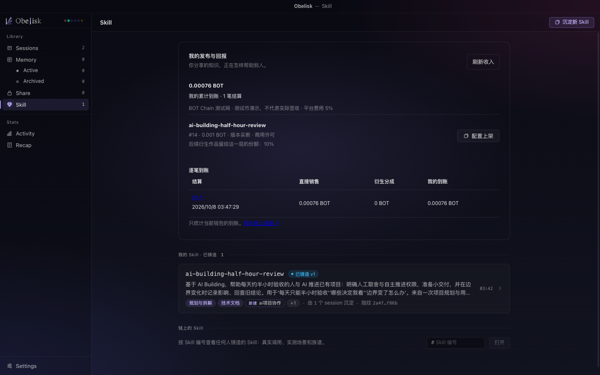
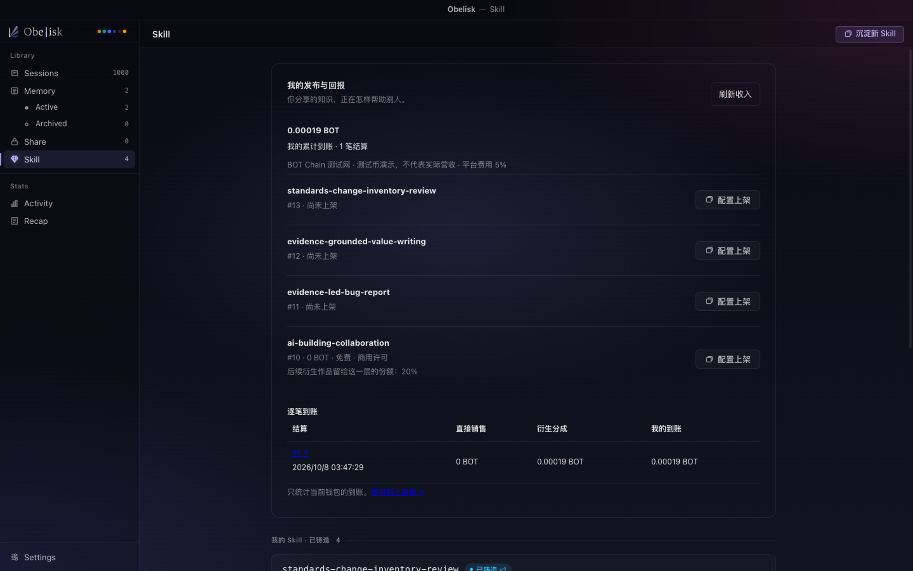

# 测试网购买、交付与三方分账

2026-10-08，#42 的首个真实闭环。网络为 BOT Chain 测试网（968）；测试币不代表实际营收。交易执行使用固定 CLI 产物 `7852072`，线上 Worker 为 `324f98d8-326b-41c1-9f08-ff1dbd5e15a6`。

## 来自什么过程

首轮自然请求生成项目协作计划。第二轮模拟用户明确选择 AI Building 方法，再要求改编为“每天只能抽半小时验收”的版本，真实 AI 生成草稿；这轮不是自主发现样本。AI 按请求只保存草稿，之后由操作者单独审阅并发布为 #14，父资产为 #10。

采集批次的四笔发布额度用于 #10–#13。以下是独立的结算验收范围：一份衍生资产、两份上架方案、一笔购买、一笔使用回执；只在测试网执行。三个演示钱包各补至 0.05 测试 BOT。本阶段没有新增 AI 调用，前两轮合计六次。

## 资产与规则

- [原资产 #10](https://obelisk-service.kinomotomiovo.workers.dev/market/skills/10)：免费、商用许可，衍生上游比例 20%。
- [衍生资产 #14](https://obelisk-service.kinomotomiovo.workers.dev/market/skills/14)：0.001 BOT、版本买断、商用许可；未来继续衍生时留给这一层 10%。
- 平台 Demo 费率 5%；先扣平台费用，再按照父层约定分配。比例是演示配置，创作者可设置自己的上架方式和许可。
- #14 从首次发布就是授权正文。公开接口仅返回描述和锁定状态；旧公开正文没有重新变为私密。

## 实际结果

[购买交易](https://scan.bohr.life/tx/0x86f58b4cc59bbddf4a7be36cf7dfda853609148f9309570b3267b03846a50e31)支付 0.001 BOT：

| 受益者 | 到账 |
| --- | ---: |
| 衍生作者 | 0.00076 BOT |
| 原作者 | 0.00019 BOT |
| 平台 | 0.00005 BOT |

三者合计与本金一致，收入 API 和 App 读回同一笔交易。重复提交相同购买 requestId 返回原交易，没有新增购买。

[使用回执](https://scan.bohr.life/tx/0x688ad19595e7fdb1ca8177fc9e7d793a6f5b72dab83e3225de35a617ecca2209)产生后，买家签名取得正文并安装到 Codex；安装正文指纹与链上 `2a4f68c72caae4806cfef2b1a91526e1da6d07ad982f731cbc6c7f57f61bf86b` 一致。另一个钱包使用该回执尝试取用，被服务拒绝：`The retrieval receipt belongs to another buyer or action`。安装不等于已发生 AI 调用，市场的调用次数没有因此增加。

## 不同界面

浏览器核对市场 #14：价格、许可、版本、族谱、衍生邀请；没有原始分账明细。独立[平台运营页](https://obelisk-service.kinomotomiovo.workers.dev/operations)显示 1 笔结算、5% 费用、平台 0.00005 BOT 及三方到账。

以下截图由当前构建的本地 App 读取真实测试网服务生成，不是夹具：

机器可读[结算证据](assets/market-settlement/receipt.json)保留地址、交易和金额。先前合约、本地 EVM、CLI、服务及 Electron 的检查记录见 #42 评论；本次补充真实测试网和真实 App 验收。App 源码构建已验证，尚不等于替换用户已安装的桌面发行包。主网部署仍由 #5 承接。
