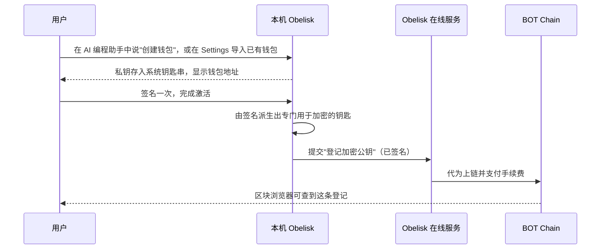

# 01 · 身份与链上账本

> 每个用户用一个钱包地址作为身份；分享规则、Skill 资产、使用统计和分成规则记在 BOT Chain 这本公共账本上。后面所有功能都建在这一层之上。

## 解决什么问题

后面的每个功能都需要两样东西。

- **一个不依赖平台账号的身份**：分享要知道"给谁"，Skill 要知道"作者是谁"，统计要知道"是不是同一个人在重复计数"。
- **一本大家都信得过、谁也改不了的账**：分享规则、Skill 归属、调用统计、分成，如果只存在我们的数据库里，用户只能选择相信我们。

## 用户看到什么

- 第一次开启链上功能时，在 AI 编程助手里说"帮我创建 Obelisk 钱包"（Settings 里的"生成钱包"按钮会复制这句 prompt）。私钥由 Obelisk 生成并存入系统钥匙串，不会出现在对话里。Settings 显示你的地址。
- 已有钱包的用户在 Settings 里直接导入。导入需要输入私钥或助记词，这些不能经过 AI 对话，所以这是少数在 App 里直接执行的操作。
- 第一次使用时签名一次完成"激活"，之后别人就可以把内容加密发给你。
- 之后分享、铸造、上报统计都用这个地址签名。手续费由 Obelisk 在线服务代付，用户不需要先买币。
- 每一条链上记录都可以在 BOT Chain 区块浏览器里查到。

## 为什么有价值

- **免注册**：没有账号密码，地址就是身份。
- **不被锁定**：身份和成绩不属于 Obelisk，任何读取这本账的应用都能看到同一份数据。
- **可验证**：规则和记录任何人都能核对，不需要相信我们。

## 链上记什么、不记什么

| 记在链上 | 不上链 |
| --- | --- |
| 加密公钥：别人用它把内容加密给你 | session 内容 |
| 分享授权：给谁、能开几次、何时失效、是否撤回、每次打开的回执 | Skill 正文 |
| Skill 资产：作者、版本指纹、出生场景标签、父 Skill | 你的历史记录、文件和代码 |
| 使用统计：每个 Skill 的调用次数、场景分布、结果分布（汇总数字） | 任何一次调用的细节 |
| 市场与分成：价格、许可、分成比例、付款（阶段 2） | 用户的真实姓名等个人信息 |

## 第一次使用的流程

## 功能拆分

| 编号 | 功能 | 用户能做什么 | 运行在哪里 | 需要 AI 吗 | 阶段 |
| --- | --- | --- | --- | --- | --- |
| I1 | 内置钱包 | 通过 CLI 生成钱包，或在 Settings 导入已有钱包；在 Settings 查看地址；私钥保存在本机系统钥匙串 | 本机 | 不需要 | 阶段 0 |
| I2 | 加密公钥登记 | 签名一次完成激活，别人从此可以把内容加密发给你 | 本机、在线服务、链上；网页（未安装 Obelisk 的接收方） | 不需要 | 阶段 0 |
| I3 | 链上合约 | 密钥登记、分享授权、Skill 资产、使用统计四类记录部署到 BOT Chain 主网；市场与分成在阶段 2 加入 | 链上 | 不需要 | 阶段 0 |
| I4 | 在线服务与手续费代付 | 用户只签名，在线服务提交上链并支付手续费 | 在线服务、链上 | 不需要 | 阶段 0 |
| I5 | 连接外部钱包 | 用手机钱包等已有钱包连接 App | 本机 | 不需要 | 阶段 2 |

## 上线步骤

改动部分标记：【界面】App 界面 ·【本机】本机 Obelisk（含 App 后台）·【CLI】命令行与 agent skill ·【在线服务】·【网页】网页阅读页 ·【链上】合约。

**I1 内置钱包**

1. 【本机】生成钱包，私钥存入系统钥匙串，提供签名能力。
2. 【CLI】创建钱包和查看地址的命令；输出中不出现私钥。
3. 【界面】Settings 新增"钱包"区域：显示和复制地址；"生成钱包"按钮复制成 prompt；"导入钱包"在 App 里直接完成，私钥和助记词不经过对话。

**I2 加密公钥登记**

1. 【本机】由钱包签名派生出专门用于加密的钥匙。
2. 【CLI】激活命令，与创建钱包一起完成。
3. 【链上】密钥登记合约：钱包地址 → 加密公钥。
4. 【在线服务】代为提交登记。
5. 【网页】没有安装 Obelisk 的接收方，在网页上用浏览器钱包完成同样的激活。

**I3 链上合约**

1. 【链上】编写密钥登记、分享授权、Skill 资产、使用统计四个合约。
2. 【链上】部署到 BOT Chain 主网，并在区块浏览器上公开验证源代码。

**I4 在线服务与手续费代付**

1. 【在线服务】接收用户签过名的请求，代为提交上链并支付手续费。
2. 【在线服务】读取链上数据，为 App 和网页提供查询。我们没有找到 BOT Chain 上可用的第三方链上数据索引服务，因此需要自建这一步。

**I5 连接外部钱包**

1. 【本机】支持通过扫码连接外部钱包。
2. 【界面】Settings 中提供"连接外部钱包"。

## 已知限制

- 一个人可以创建多个钱包。调用统计按钱包去重，可以防止同一个钱包重复计数，但无法证明两个钱包不属于同一个人。这一点在 [04 真实使用](04-real-usage-and-scenarios.md) 中通过证据和成本来约束。
- 阶段 1 的链上手续费由团队承担。2026-10-06 实测，BOT Chain 主网上一笔普通转账的手续费约为 0.00042 BOT。

## 参考

- BOT Chain 开发者文档：<https://dev-docs.botchain.ai/docs/Developers/quick-guide/>
- BOT Chain 区块浏览器：<https://scan.botchain.ai/>
