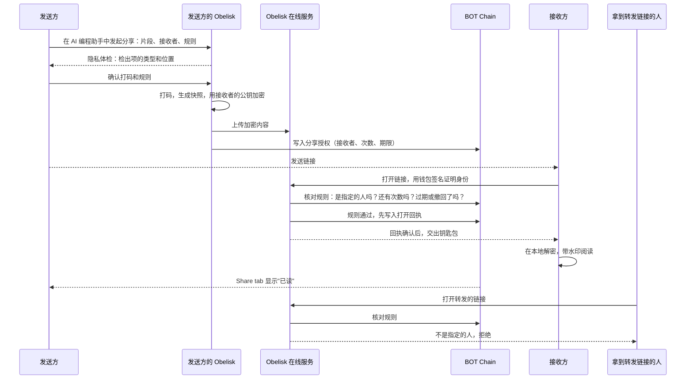

# 02 · 私密分享：只给 TA 看

> 把一段 session 加密后分享给一个钱包地址，只有这个钱包能打开。可以限次、限时、撤回，能看到对方是否已读；截图外泄时，可以追溯到是哪一份。

界面示意：[mockups/private-sharing.html](mockups/private-sharing.html)

## 解决什么问题

举个例子：小周和 Claude Code 一起花了一下午，修好了一个棘手的支付 bug。小周想把这段 session 发给新同事参考，或者发给面试官证明自己的能力。今天只能导出文件或截图：

- 发出去就收不回来；
- 对方可以随手转给任何人；
- 不知道对方有没有看、还有谁看过；
- session 里混着密钥和内部路径，一不小心就泄露了。

## 用户看到什么

**发送方**（在 AI 编程助手里完成，App 负责展示）

1. 在 Session 详情页选择消息范围，填写接收者的钱包地址和规则（例如"只能打开 1 次""24 小时内有效"），点"生成分享链接"，复制出一段 prompt，粘贴到 AI 编程助手里。也可以直接对 AI 编程助手说"把这段 session 分享给 0x…，只能打开 1 次"。
2. 隐私体检：Obelisk 在对话里列出检测到的密钥、密码、本地路径、邮箱等，只显示类型和位置，不显示原值。你说"全部打码"，或者逐条决定。
3. 预览接收者、规则和打码情况，确认后生成链接。
4. 之后在 **Share** tab 里能看到每条分享的状态：未读、已读（附时间和链上记录）、已过期、已撤回。撤回也是一句话，Share tab 里的"撤回"按钮会复制这句 prompt。

**接收方**

- **没有安装 Obelisk**：在浏览器打开链接，连接钱包，就能看到和 App 里一样的对话时间线（只读）。页面上印着接收者地址的水印。
- **安装了 Obelisk**（阶段 2）：分享出现在 Share tab 的"收到的"列表里，和自己的记忆分开存放。

**拿到被转发链接的其他人**：页面只显示"此内容属于 0x…，你无法打开"。

## 为什么有价值

- **敢分享**：内容在你的电脑上加密后才离开，只有指定的人能解开；在线服务和 Obelisk 团队都看不到内容。
- **可控**：次数、期限、撤回由公共账本上的规则决定，回执可查，不靠我们的一句承诺。
- **可追责**：接收者看到内容后，抄写和截图在技术上无法阻止。但带水印的截图一旦流传，包括被上传给 AI 服务，泄露就有据可查、能够被追究。
- **两种形态，两种需求**：网页分享是"给人看"；App 内接收是"给 AI 接着用"。导出的 Markdown 只能读，对方的 AI 无法追问；App 内接收保留了 Obelisk 中间表示里的因果和出处，这也是[上下文付费](05-market-and-revenue.md)的基础。

## 一次分享的完整旅程

## 两种接收形态

| | 网页阅读页 | App 内接收 |
| --- | --- | --- |
| 对方需要什么 | 浏览器和钱包 | Obelisk App |
| 主要用途 | 给人看：可读。展示、求助、评审 | 给 AI 接着用：对方的 AI 可以顺着因果、工具调用和子 agent 追问，并始终知道这段历史来自别人。交接工作，把别人的经验作为上下文 |
| 控制能力 | 指定钱包、限次、限时、撤回、已读回执、水印 | 网页的全部能力，加上：不落地明文、不能导出、到期自动销毁、与自己的记忆隔离 |
| 首次上线 | 阶段 1 | 阶段 2 |

两种形态使用同一份加密快照，差别只在接收端。

## 功能拆分

| 编号 | 功能 | 用户能做什么 | 运行在哪里 | 需要 AI 吗 | 阶段 |
| --- | --- | --- | --- | --- | --- |
| S1 | 指定钱包可读 | 分享给一个钱包地址，只有该钱包能打开，转发无效 | 本机（打包、加密）、在线服务（存密文）、链上（授权） | 不需要 | 阶段 1 |
| S2 | 打开规则 | 限制打开次数和有效期，随时撤回 | 链上（规则与回执）、在线服务（核对后放行） | 不需要 | 阶段 1 |
| S3 | 已读回执与 Share tab | 查看每条分享的状态和链上回执 | 本机（界面）、在线服务、链上 | 不需要 | 阶段 1 |
| S4 | 网页阅读页 | 接收方不用安装 Obelisk，用浏览器钱包打开 | 网页、在线服务 | 不需要 | 阶段 1 |
| S5 | 可见水印 | 阅读页印上接收者地址、分享编号和打开时间 | 网页 | 不需要 | 阶段 1 |
| S6 | 分享前隐私体检 | 自动检出密钥、密码、路径、邮箱、电话；一句话全部打码，或逐条决定 | 本机 | 阶段 1 不需要（按常见格式识别）；阶段 2 需要（识别人名、客户名等格式规则覆盖不到的内容） | 阶段 1：常见格式；阶段 2：更全面的识别 |
| S7 | 泄露追踪 | 每份内容带看不见的指纹；粘贴一段外泄文字，就能查出来自哪一份 | 本机、链上 | 不需要 | 阶段 2 |
| S8 | App 内接收 | 收到的分享进入 Share tab，与自己的记忆隔离；只有明确要求时 AI 才会查询 | 本机 | 不需要 | 阶段 2 |
| S9 | 只给 AI 用 | 接收方的 AI 可以查询这段 session 来回答问题，界面不展示原文 | 本机（接收方的 AI 编程助手） | 需要 | 阶段 3 |

## 上线步骤

改动部分标记：【界面】App 界面 ·【本机】本机 Obelisk（含 App 后台）·【CLI】命令行与 agent skill ·【在线服务】·【网页】网页阅读页 ·【链上】合约。

**S1 指定钱包可读 + S4 网页阅读页**

1. 【本机】从 session 详情生成快照，附上来源、截取时间和打码说明（与 #64 的设计一致），再加密给接收者。
2. 【在线服务】保存加密内容，生成分享链接。
3. 【链上】写入分享授权：接收者地址和内容指纹。
4. 【网页】连接钱包、签名、取回钥匙包、解密，渲染对话时间线。
5. 【CLI】分享命令：指定片段、接收者和规则，先给出预览（包括隐私体检结果），用户确认后执行。
6. 【界面】Session 详情页加入分享入口：选择范围、填写接收者和规则；"生成分享链接"按钮复制成 prompt。

**S2 打开规则**

1. 【链上】分享授权加入次数上限、有效期和撤回状态。
2. 【在线服务】交出钥匙包之前核对链上规则，并先写入打开回执；回执确认后才交出钥匙包，这样次数上限不会被绕过。撤回时一并删除服务上保存的加密内容。
3. 【CLI】分享命令支持次数和有效期；新增撤回命令。
4. 【界面】Share tab 的"撤回"按钮复制成 prompt。

**S3 已读回执与 Share tab**

1. 【在线服务】根据链上回执提供分享状态查询。
2. 【界面】新增 Share tab，"已发送"列表显示每条分享的状态和链上记录链接。

**S5 可见水印**

1. 【网页】在内容上叠加接收者地址、分享编号和打开时间。

**S6 分享前隐私体检**

1. 【本机】按常见格式识别密钥、令牌、密码、本地路径与用户名、邮箱和电话。
2. 【CLI】在分享预览中列出检出项的类型和位置，不显示原值；用户可以全部打码，也可以逐条决定。快照注明打码的位置。

**S7 泄露追踪**

1. 【本机】为每位接收者在内容里嵌入不同的隐形指纹；指纹和接收者的对应关系在分享时登记上链。
2. 【CLI】泄露追踪命令：给出一段外泄的文字，识别它来自哪一份分享。
3. 【界面】在 Share tab 中展示追踪结果。

**S8 App 内接收**

1. 【本机】收件库：独立于自己索引的存储，到期自动清除。
2. 【本机】AI 查询默认不包含收件库；用户明确要求时才查询，结果标明来自他人。
3. 【界面】Share tab 新增"收到的"列表。
4. 【CLI】在 agent skill 文档中说明如何查询收件库。

**S9 只给 AI 用**

1. 【本机】接收方的 AI 通过 Obelisk 查询收件库中的这段 session，只返回回答。
2. 【界面】这类分享在 Share tab 中不提供原文阅读。

## 已知限制

- 接收者看到内容后可以抄写、截图或让 AI 转述，这在技术上无法阻止；水印（S5）和指纹（S7）让泄露可以追溯。
- 阶段 1 的"交出钥匙包"由 Obelisk 在线服务按链上规则执行。规则和回执公开可查，但这一步本身需要信任在线服务。
- 接收者需要先完成一次激活（见 [01](01-identity-and-chain.md)），发送方才能把内容加密给对方。

## 参考

- #64 分享可读的 session 快照，不导入对方的检索历史
- #71 让分享产物在 Obelisk 中有可见的管理入口
