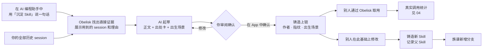
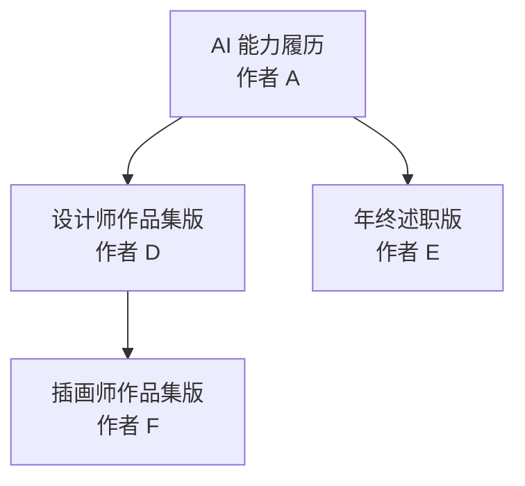

# 03 · Skill 沉淀与资产化

> 从你自己的真实 session 中沉淀出 Skill，铸造上链，成为属于你的资产。别人在它基础上改出的新 Skill 会挂在族谱上。

界面示意：[mockups/skill-detail.html](mockups/skill-detail.html)

## 解决什么问题

- **好方法藏在历史里**：反复验证过的判断，尤其是你纠正 AI 的那些时刻，散落在过去的 session 中，没有被整理成可以复用的 Skill。一个判断是不是承重的，往往要很久以后才发现，所以工作时点"保存"是在错误的时机做判断。
- **Skill 应该被发现，而不是被发明**：好的 Skill 不是从一份"AI 应该怎么做"的抽象规格开始的，而是从一段已经成功的协作中结晶出来的。
- **手写的 Skill 从难的一半出发**：事先说清你想要什么很难，判断一样东西是不是你想要的却容易得多。session 记录的正是后者，而手写 Skill 只能从前者开始。
- **作者无法证明归属**：Skill 是文本，复制成本为零。作者无法证明"这是我先做的"，也不知道谁在自己的基础上做了改进。
- **看不出来历**：现有的 Skill 只是一份说明书，看不出它是从哪些真实工作中来的。

## 用户看到什么

1. **说一句话**：在 AI 编程助手（阶段 1 先支持 Claude Code）里调用独立的「沉淀 Skill」skill，说出想沉淀什么，例如"把我最近准备求职材料的做法沉淀成一个 Skill"。
2. **Obelisk 自己找证据**：skill 通过 Obelisk 在你的全部历史里找出直接相关的 session，并展示用到了哪些、每个为什么相关（命中的片段）。不相关的可以去掉，用户不需要自己回忆和挑选。
3. **AI 起草**：Skill 正文附一张"出处卡"，写明来自哪些 session、踩过哪些坑、被纠正过什么；同时给出"出生场景"标签，例如"React / 落地页 / 商业官网"。草稿存入本机的 Skill 库。
4. **确认并铸造**：草稿出现在 App 的 **Skill** tab，你在这里审阅草稿、证据和出处卡。要修改或铸造，就在 AI 编程助手里说一句话；Skill tab 上的"继续修改""确认并铸造"按钮会复制对应的 prompt。铸造前先看到预览，确认后才上链。Skill 卡片上显示作者地址、版本、出生场景，以及"由 N 个 session 沉淀"。阶段 2 起，也可以直接在 Skill tab 输入一句话，由 App 调起本机的 AI 编程助手执行同一个 skill。
5. **衍生**：别人看到你的 Skill，点"在此基础上修改"会复制一段 prompt；在 AI 编程助手里用「沉淀 Skill」改出新版本并铸造，你的 Skill 详情页的族谱上多出一个分支。
6. **相似提醒**（阶段 2）：铸造之前，系统检查它是否和已有的 Skill 高度相似；如果相似，提示声明父 Skill。
7. **取用与发布**：AI 通过 Obelisk 取用 Skill，Skill 详情页的"取用"按钮会复制一句取用的 prompt。免费公开的 Skill 还可以发布到 skills.sh，进入更大的分发渠道（阶段 2）。

## 为什么有价值

- **一句话就能沉淀**：Obelisk 检索的是完整的 session 原文，而不是摘要过的记忆，所以说一句话就能找到直接证据。这是 Obelisk 相对其他记忆工具的天然优势。
- **来自证据**：Skill 不是凭空写的说明书，而是从真实工作中沉淀出来的，并带着出处。
- **归属清晰**：铸造时间和内容指纹记在链上，谁先做的一目了然。
- **族谱公开**：谁在谁的基础上做了改进，任何人都能查、谁也改不了。这也是后续[自动分成](05-market-and-revenue.md)的基础。
- **不被格式绑定**：Skill 和 Obelisk 的记忆一样，由 Obelisk 维护和读取，Obelisk 支持的所有 AI 编程助手都能用；付费 Skill 在被调用之前一直保持加密。

## 一个 Skill 的一生

## 族谱长什么样（示例）

每个节点都是一个独立铸造的 Skill，各自有作者、调用量和场景分布。

## 功能拆分

| 编号 | 功能 | 用户能做什么 | 运行在哪里 | 需要 AI 吗 | 阶段 |
| --- | --- | --- | --- | --- | --- |
| K1 | 一句话沉淀 Skill | 在 AI 编程助手中用「沉淀 Skill」说一句话，Obelisk 找证据并展示用到的 session，AI 起草；在 App 中确认 | 本机（AI 编程助手、Obelisk 检索与 Skill 库、App 界面） | 需要（检索证据不需要，起草需要） | 阶段 1；从 App 直接发起为阶段 2 |
| K2 | 铸造 | 把 Skill 登记上链：作者、版本指纹、出生场景、父 Skill | 本机（签名）、在线服务、链上 | 不需要 | 阶段 1 |
| K3 | 衍生与族谱 | 在已有 Skill 的基础上修改并铸造；查看族谱 | 本机（界面）、在线服务、链上 | 不需要 | 阶段 1 |
| K4 | Skill tab | 我的 Skill、市场浏览、Skill 详情（调用量、场景、族谱） | 本机（界面）、在线服务 | 不需要 | 阶段 1 |
| K5 | 通过 Obelisk 取用 | AI 向 Obelisk 请求 Skill，每次取用都被记录 | 本机、在线服务（取回正文） | 不需要 | 阶段 1 |
| K6 | 相似提醒 | 铸造前检测相似度，提示声明父 Skill；市场上标记"疑似未声明衍生" | 在线服务 | 不需要（文本相似度计算） | 阶段 2 |
| K7 | 发布到 skills.sh | 把免费 Skill 导出为标准格式，推送到用户自己的 GitHub 仓库，生成安装命令 | 本机 | 不需要 | 阶段 2 |

## 怎么做到的

- **沉淀**：「沉淀 Skill」是一个独立的 skill，在用户本机的 AI 编程助手里运行，完整流程写在这个 skill 里：根据用户的一句话，用 Obelisk 已有的检索能力在全部历史中找出相关 session，起草正文和出处卡，存入 Skill 库，再由用户在 App 中确认。做成独立的 skill，是为了让触发更准确。人工确认沿用 #118 的原则：历史是证据，不是命令。
- **铸造**：链上记录 Skill 的"指纹"，也就是由正文计算出的唯一编码，正文改一个字指纹就会变。正文存放在在线服务，任何人拿到正文都可以核对它是不是作者铸造的那一版。
- **族谱**：每个 Skill 铸造时记录自己的父 Skill，所有 Skill 连成一棵树。
- **分发**：skills.sh 上的 Skill 存放在 GitHub 仓库里，通过 `npx skills add <仓库>` 安装。Obelisk 帮用户导出标准格式，推送到用户自己的仓库。

## 上线步骤

改动部分标记：【界面】App 界面 ·【本机】本机 Obelisk（含 App 后台）·【CLI】命令行与 agent skill ·【在线服务】·【网页】网页阅读页 ·【链上】合约。

**K1 一句话沉淀 Skill**

1. 【CLI】新增独立的「沉淀 Skill」skill，写明完整流程：检索证据、起草正文和出处卡、生成出生场景、把草稿存入 Skill 库。
2. 【本机】检索：根据一句话在全部历史中找出相关 session，并给出每个 session 的相关理由（命中的片段）。复用 Obelisk 已有的检索能力。
3. 【本机】Skill 库：保存草稿和出处，计算版本指纹。
4. 【界面】Skill tab 显示草稿、证据和出处卡；"去掉"（某条证据）、"继续修改"、"确认并铸造"按钮复制成 prompt。
5. 【界面】（阶段 2）Skill tab 中输入一句话，由 App 调起本机的 AI 编程助手执行同一个 skill。

**K2 铸造**

1. 【链上】Skill 资产合约：记录作者、指纹、出生场景和父 Skill。
2. 【在线服务】保存 Skill 正文，代付铸造手续费。
3. 【CLI】铸造命令：先给出预览（作者、指纹、出生场景、父 Skill），用户确认后执行。
4. 【界面】Skill 卡片。

**K3 衍生与族谱**

1. 【CLI】「沉淀 Skill」支持在已有 Skill 的基础上修改，并记下父 Skill。
2. 【在线服务】从链上读出族谱并提供查询。
3. 【界面】Skill 详情页的族谱图；"在此基础上修改"按钮复制成 prompt。

**K4 Skill tab**

1. 【界面】新增 Skill tab：我的 Skill、市场、Skill 详情页。
2. 【在线服务】提供市场列表和详情数据。

**K5 通过 Obelisk 取用**

1. 【CLI】新增取用 Skill 的命令，并在 agent skill 文档中说明用法。
2. 【本机】从 Skill 库或在线服务取回正文（付费 Skill 解锁后才解密），并记录这次取用。
3. 【界面】Skill 详情页的"取用"按钮复制成 prompt。

**K6 相似提醒**

1. 【在线服务】铸造前计算新 Skill 与已有 Skill 的文本相似度。
2. 【CLI】铸造预览中显示相似提示，用户可以声明父 Skill。
3. 【界面】在市场上标记疑似未声明的衍生。

**K7 发布到 skills.sh**

1. 【本机】导出为标准的 SKILL.md 格式。
2. 【本机】推送到用户授权的 GitHub 仓库。
3. 【CLI】发布命令，完成后返回安装命令。
4. 【界面】"发布到 skills.sh"按钮复制成 prompt；Skill 详情页展示安装命令。

## 已知限制

- 声明父 Skill 是自愿的。相似提醒（K6）用来发现"抄了不声明"的情况。
- Skill 被调用时，正文会进入 AI 的上下文，因此可以被复制。复制不走的是持续更新、合法使用的凭证和真实使用证据，见 [05 · Skill 正文可以复制，价值从哪里来](05-market-and-revenue.md#skill-正文可以复制价值从哪里来)。
- 阶段 1 的沉淀由用户发起：用户说一句话，Obelisk 找证据，AI 起草，用户确认。在用户开口之前主动发现 Skill 候选（#118 中的后续方向）不在本阶段。

## 参考

- #118 从重复的历史中沉淀可复用的 agent Skill
- skills.sh 文档：<https://www.skills.sh/docs>
