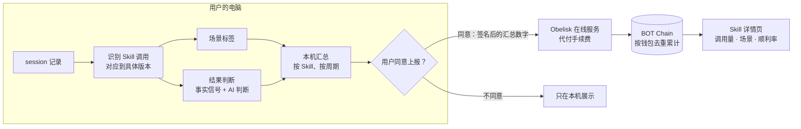

# 04 · 真实使用与场景归因

> Obelisk 从真实 session 中统计每个 Skill 被调用了多少次、在什么场景下用、效果如何。不看描述，看证据。

界面示意：[mockups/skill-detail.html](mockups/skill-detail.html)

## 解决什么问题

举个例子：市场上有 10 个"前端" Skill，评分都很高。你要的是做创意 PPT 的前端 Skill，但其中最火的那个其实是为电商后台写的。作者为了推广，把描述写得尽可能宽，你没有办法分辨。

安装量也说明不了问题：装了不等于用了，用了不等于好用，而且安装量可以刷。

## 用户看到什么

在 Skill 详情页：

- **真实调用量**：被调用的总次数、来自多少个不同的钱包，以及随时间的趋势。
- **实测场景分布**：每个场景下的调用次数和顺利率，例如"创意 PPT"和"电商后台"分开统计。
- **作者描述与实测场景并排展示**：描述夸大了多少，一眼可见。
- **出生场景**：这个 Skill 当初是从什么样的工作中沉淀出来的。
- **结果说明**：顺利率旁边始终标注样本数，以及"无法判断"的比例。

阶段 2 增加：

- **按场景搜索**：搜"创意 PPT"，按实测场景匹配，而不是按描述文字匹配。
- **个性化推荐**：Obelisk 知道你平时在做什么，推荐在相似场景里被验证过的 Skill。匹配在你的电脑上完成，你的历史不会上传。

## 为什么有价值

- **别人做不到**：现有的 Skill 目录只能统计安装量（skills.sh 的排行榜明确基于匿名安装统计，不收集使用情况，见[其 FAQ](https://www.skills.sh/docs/faq)）。Obelisk 本来就记录 AI 每次调用 Skill 以及当时加载的完整内容，所以能统计真实调用和效果。
- **更难造假**：每次调用都来自一段真实的 session，按钱包去重，并带有场景和结果分布。想刷调用量，就得真的去跑 AI 任务，比买安装量、买粉丝贵得多。
- **隐私不受影响**：分析在用户自己的电脑上完成，需要 AI 的部分交给用户本来就在用的 AI 编程助手。交给 Obelisk 的只有汇总数字和场景标签。

## 数据从哪里来、到哪里去

## 三个判断分别怎么做

**1. 识别调用（事实）**

Obelisk 的索引已经记录了每次 Skill 调用，以及当时加载的 Skill 全文。用全文计算指纹，就能对应到链上铸造的具体版本。

**2. 场景标签（判断）**

- 出生场景：沉淀 Skill 时，根据来源 session 打标签。
- 实测场景：每次调用时，根据调用所在的 session 打标签。
- 标签从一份固定的场景列表中选取（技术领域、任务类型、产出物类型），这样不同用户的标签才能汇总比较。

**3. 结果判断（事实 + 判断）**

session 里通常没有人明说"成功"或"失败"，所以分两层：

1. **事实信号**，直接统计、不做推断：调用之后的工具报错、用户的纠正或打断、同一个文件被反复修改、同一个 Skill 被重复调用。
2. **AI 判断**：把调用之后的那一段交给本机的 AI 编程助手，判为"顺利 / 有返工 / 失败 / 无法判断"。无法判断的不计入顺利率。

界面上用"顺利率"而不是"成功率"，并始终标注样本数和无法判断的比例。

## 由谁来执行、费用由谁承担

场景标签和结果判断需要 AI。Obelisk 不另外接入模型服务，而是把这些判断交给用户本机的 AI 编程助手（阶段 1 先支持 Claude Code）在后台批量执行，费用走用户自己的订阅。

| 阶段 | 怎么做 | 费用 |
| --- | --- | --- |
| 阶段 1 | 事实信号用规则直接统计；场景标签和结果判断由本机的 AI 编程助手批量执行 | 用户自己的 AI 编程助手额度 |
| 阶段 2 | 拆成更省的小任务：报错和返工用规则统计；"用户这句话是在认可、纠正、追问，还是开始新任务"用本机小模型分类；场景标签用本机模型与固定场景列表匹配。只有本机判断不了的少数情况才交给 AI 编程助手。阶段 1 的判断结果用作训练和校验数据 | 大部分在本机运行，不消耗额度 |

后台任务多久执行一次、每天最多消耗多少额度，尚未决定，见[路线图的待决策](07-roadmap.md#待决策)。

## 演示阶段的数据从哪里来

演示阶段还没有真实用户。调用量、场景分布和结果分布由 [Playground](09-playground.md) 产生：在一台电脑上创建多个模拟用户，让他们通过本机的 AI 编程助手真实地使用 Skill，完成不同场景的任务，走一遍 Obelisk 的完整流程。数据是真实跑出来的，不是编造的；App 里的每个数字都可以查到来源：哪一次运行、哪些 session、用什么方法算出来。

## 功能拆分

| 编号 | 功能 | 用户能做什么 | 运行在哪里 | 需要 AI 吗 | 阶段 |
| --- | --- | --- | --- | --- | --- |
| U1 | 识别调用与版本 | 本机自动识别每次 Skill 调用，对应到具体版本 | 本机 | 不需要 | 阶段 1 |
| U2 | 场景标签 | 每个 Skill 有出生场景，每次调用有实测场景 | 本机（AI 编程助手） | 需要 | 阶段 1 |
| U3 | 结果判断与顺利率 | 看到事实信号和顺利率，附样本数 | 本机（事实信号由 Obelisk 统计，结果判断由 AI 编程助手执行） | 事实信号不需要；结果判断需要 | 阶段 1 |
| U4 | 汇总上报 | 用户开启后，汇总数字签名上链；按钱包去重，手续费代付 | 本机（签名）、在线服务、链上 | 不需要 | 阶段 1 |
| U5 | 描述与实测并排 | Skill 详情页并排展示作者描述和实测场景 | 在线服务、本机（界面） | 不需要 | 阶段 1 |
| U6 | 按场景搜索与个性化推荐 | 按实测场景找 Skill；在本机按你的历史推荐 | 在线服务（场景检索）、本机（推荐匹配） | 不需要 | 阶段 2 |
| U7 | 本机低成本判断 | 场景标签和结果判断大部分改用规则和本机小模型完成，少消耗 AI 编程助手的额度 | 本机 | 需要（本机小模型） | 阶段 2 |

## 上线步骤

改动部分标记：【界面】App 界面 ·【本机】本机 Obelisk（含 App 后台）·【CLI】命令行与 agent skill ·【在线服务】·【网页】网页阅读页 ·【链上】合约。

**U1 识别调用与版本**

1. 【本机】从已有索引中找出 Skill 调用（包括通过 Obelisk 取用的 Skill，见 [03](03-skill-assets.md) K5），用加载内容计算指纹，对应到 Skill 版本。

**U2 场景标签**

1. 【本机】确定固定的场景列表。
2. 【本机】把出生 session 和调用所在的 session 批量交给本机的 AI 编程助手打标签，结果存回本机。

**U3 结果判断与顺利率**

1. 【本机】统计事实信号。
2. 【本机】把调用之后的片段批量交给本机的 AI 编程助手做结果判断。
3. 【本机】汇总成每个 Skill 的结果分布。

**U4 汇总上报**

1. 【CLI】开启和关闭上报的命令（默认关闭）；开启前展示将要上报的内容。
2. 【界面】显示上报状态和已上报的内容；"开启上报"按钮复制成 prompt。
3. 【本机】按周期生成汇总并签名。
4. 【在线服务】代为提交上链。
5. 【链上】使用统计合约：按钱包去重累计。

**U5 描述与实测并排**

1. 【在线服务】汇总链上统计，生成实测场景分布。
2. 【界面】Skill 详情页并排展示作者描述和实测场景。

**U6 按场景搜索与个性化推荐**

1. 【在线服务】支持按场景检索 Skill。
2. 【本机】根据你的历史计算你的场景画像，在本机完成匹配。
3. 【CLI】按场景搜索 Skill 的命令。
4. 【界面】Skill tab 展示推荐列表和场景搜索结果。

**U7 本机低成本判断**

1. 【本机】规则统计，加上本机小模型分类。
2. 【本机】用阶段 1 的判断结果训练，并用 Playground 的已知答案校验（[09](09-playground.md) G7）。

## 已知限制

- 结果判断是推断，不是事实，所以和事实信号分开展示。
- 按钱包去重无法证明不同钱包属于不同的人。刷量仍然可能，但成本高于买安装量。
