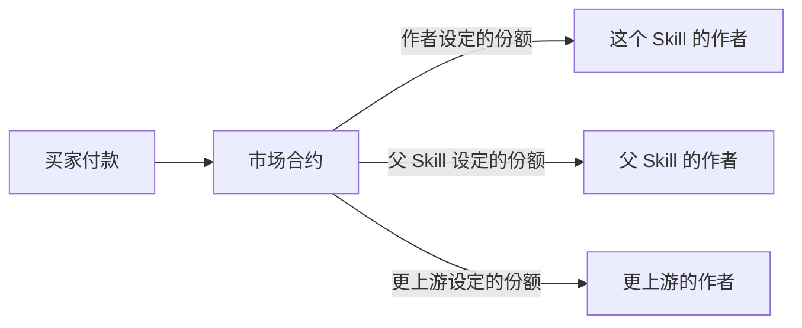
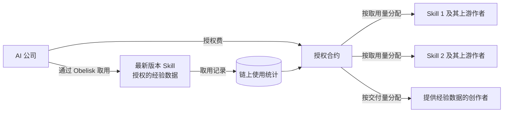

# 05 · 市场与收益

> Skill 和 session 都可以定价出售。衍生作品的收入按族谱自动分给上游作者；AI 公司为最新版本、合规凭证和真实经验付费，钱按真实用量分给每个创作者。

界面示意：[mockups/market-and-revenue.html](mockups/market-and-revenue.html)

## 解决什么问题

- **创作者拿不到回报**：好 Skill 被免费复制，别人改一改就当成自己的，原作者什么也得不到。
- **买家无从判断**：付费之前，不知道一个 Skill 值不值这个价。
- **AI 公司大批量白嫖**：AI 公司大规模使用社区创作的 Skill，创作者得不到回报。
- **正文一公开就被复制**：Skill 是文本，任何人看到就能复制。只卖文本，第一个买家之后就卖不动了。

## 两种可以卖的东西

- **Skill（方法）**：告诉 AI 怎么做。
- **上下文（经验）**：一段真实的 session，告诉 AI 这件事之前是怎么做成的、踩过哪些坑。

大家都在卖 Skill，我们还能卖上下文。两者不是谁取代谁，我们都支持。

## 用户看到什么

阶段 1 用界面截图展示，阶段 2 实现。

1. **上架**：在 AI 编程助手里说一句话，例如"把这个 Skill 按次 0.5 BOT 上架，个人使用许可"。Skill tab 的上架页可以选好价格（免费 / 按次 / 买断）和许可（个人 / 商用），"上架"按钮会把这句 prompt 复制出来。如果它是衍生作品，自动带出上游作者的分成比例。预览确认后上链。
2. **看使用数据**：详情页展示真实调用量、实测场景、顺利率和付费解锁人数（来自 [04](04-real-usage-and-scenarios.md)）。
3. **设置分成规则**：一张流向图展示一笔收入如何拆给作者和各级上游作者。规则写在链上，付款时自动执行。
4. **看收入**：收入面板按 Skill 和来源（直接销售、衍生分成、AI 公司授权）分类，每一笔都对应链上记录。
5. **上下文付费**：分享一段 session 时加上价格，对方付款后按[私密分享](02-private-sharing.md)的规则解锁。买家同样在 AI 编程助手里一句话购买，付款前先确认。
6. **AI 公司授权**（阶段 3）：公司通过 Obelisk 取用最新版本的 Skill 和创作者授权的经验数据，获得链上授权记录；费用按实际取用量分给对应的创作者。

## 钱怎么流动

衍生 Skill 铸造时，按父 Skill 设定的比例把份额留给上游；付款时由合约一次性拆分到各个钱包，不需要人工对账。

## Skill 正文可以复制，价值从哪里来

先说清楚事实：

- **铸造不等于公开**：链上只记录指纹，付费 Skill 的正文加密存放在在线服务。
- **但只要被使用，就能被复制**：Skill 被调用时，正文会进入 AI 的上下文，也会出现在使用者自己的 session 记录里。买家可以把它存成一份普通文件，不再付费。这在技术上无法阻止，我们也不假装能阻止。

所以我们卖的不是"一段文本"。复制走的只是一份快照，下面这些复制不走：

| 复制不走的 | 为什么复制不走 | 对谁有价值 |
| --- | --- | --- |
| 持续更新 | 作者根据实测场景和顺利率不断改进 Skill。新版本只通过 Obelisk 加密送达，复制的副本停在旧版本 | 依赖这个 Skill 干活的个人和团队 |
| 合法使用的凭证 | 授权记录在链上，证明"我是合法使用的"；铸造时间和指纹证明谁是作者，相似提醒（[03](03-skill-assets.md) K6）能发现未声明来源的复制 | 需要合规的公司 |
| 真实使用证据 | 调用量、场景分布和顺利率来自真实使用，只能在网络中积累，复制正文带不走 | 买家据此判断值不值；作者据此建立信誉、定价 |
| 上下文（经验） | 每份 session 单独加密给一个接收者，带水印和隐形指纹，外流可以追溯；新的 session 每天都在产生 | 需要经验的个人；需要真实过程数据的 AI 公司 |

这和音乐、软件的处境一样：盗版一直存在，正版靠更新、便利和合法性赚钱。

## AI 公司授权

AI 公司有能力复制任何公开的文本。它们缺的是另外两样：

1. **可以放心商用的授权**：每个用到的 Skill 和版本都有链上授权记录，出现争议时可以出示。
2. **持续、成规模、带出处的真实经验**：AI 怎样一步步把事做成、在哪里被用户纠正、结果如何。这些都在 session 里，而 session 只在创作者自己的电脑上。

所以授权卖的不是 Skill 文本，而是三样东西：

| 授权内容 | 怎么交付 | 怎么计费 |
| --- | --- | --- |
| 最新版本的 Skill | 通过 Obelisk 的接口取用，每次取到当前最新版本 | 按实际取用量 |
| 授权记录 | 每个 Skill、每个版本的授权写在链上，可以出示、可以审计 | 包含在授权费中 |
| 经验数据 | 创作者主动选择加入，经过隐私体检的 session；每份带这家公司专属的隐形指纹 | 按交付的 session 数量 |

计费只看经过 Obelisk 的取用，因为只有这部分能被计量。钱沿着族谱流向每一个贡献者。

## 为什么有价值

- **对创作者**：收入按规则自动到账，不依赖平台结算。
- **对衍生创新**：在别人基础上改进可以合法获利，原作者也持续受益。
- **对买家**：付费依据的是真实数据，不是描述和流量。
- **对 AI 公司**：有一条合规、按用量付费的路径，获得持续更新的社区 Skill 和带出处的真实经验数据。
- **对所有人**：谁买了什么授权、付了多少钱，链上可查。

## 功能拆分

| 编号 | 功能 | 用户能做什么 | 运行在哪里 | 需要 AI 吗 | 阶段 |
| --- | --- | --- | --- | --- | --- |
| M1 | 上架 | 设置价格和许可，衍生作品自动带出上游分成 | 本机（界面、签名）、在线服务、链上 | 不需要 | 阶段 1 截图；阶段 2 实现 |
| M2 | 付费解锁 | 买家付款后获得 Skill 正文或 session 的解锁权；付费 Skill 的新版本通过 Obelisk 加密送达 | 本机、在线服务、链上 | 不需要 | 阶段 2 |
| M3 | 分成规则 | 沿族谱自动分账 | 链上、本机（界面） | 不需要 | 阶段 1 截图；阶段 2 实现 |
| M4 | 收入面板 | 按 Skill 和来源查看收入，每笔对应链上记录 | 在线服务、本机（界面） | 不需要 | 阶段 1 截图；阶段 2 实现 |
| M5 | 上下文付费 | 给一段 session 定价，付款后解锁 | 同私密分享，加上链上付款 | 不需要 | 阶段 1 截图；阶段 2 实现 |
| M6 | AI 公司授权 | AI 公司取用最新版本 Skill 和创作者授权的经验数据，获得链上授权记录；费用按取用量分给创作者 | 在线服务、链上；经验数据在创作者本机打包、打码、加密 | 不需要 | 阶段 3 |
| M7 | AI 自主选购 | AI 在某个场景反复失败时，按实测场景和顺利率挑选 Skill，在用户设定的预算内购买，用完回写结果 | 本机（AI 编程助手、Obelisk）、在线服务、链上 | 需要 | 阶段 3 |

## 上线步骤

改动部分标记：【界面】App 界面 ·【本机】本机 Obelisk（含 App 后台）·【CLI】命令行与 agent skill ·【在线服务】·【网页】网页阅读页 ·【链上】合约。

**阶段 1：截图**

1. 【界面】在 App 中做出 M1、M3、M4、M5 的真实页面，填入演示数据后截图，截图上标注"演示数据"。
2. M6 用一句话加一张示意图在路演中说明，重点讲"复制不走的是什么"。

**M1 上架**

1. 【链上】市场合约：价格、许可、分成比例。
2. 【在线服务】市场列表。
3. 【CLI】上架命令：价格、许可，衍生作品自动带出上游分成；先给出预览，确认后上链。
4. 【界面】上架页展示价格、许可和分成；"上架"按钮复制成 prompt。

**M2 付费解锁**

1. 【链上】付款即授权。
2. 【在线服务】确认付款后交出解密钥匙包，方式与私密分享相同。
3. 【CLI】购买命令：付款前先给出确认。
4. 【界面】解锁状态；"购买"按钮复制成 prompt。

**M3 分成规则**

1. 【链上】付款时按族谱上设定的比例拆分。
2. 【CLI】铸造或上架时，设置衍生作品需要留给自己的比例。
3. 【界面】分成流向图。

**M4 收入面板**

1. 【在线服务】汇总每个钱包在链上的收入。
2. 【界面】收入面板。

**M5 上下文付费**

1. 【CLI】分享命令支持设置价格。
2. 【界面】Session 详情页的分享入口可以填写价格，一并复制进 prompt。
3. 复用私密分享（S1、S2）和付费解锁（M2）。

**M6 AI 公司授权**

1. 【链上】授权合约：记录授权范围，按链上的取用统计分配。
2. 【在线服务】面向 AI 公司的取用接口，每次返回最新版本，并记录取用。
3. 【本机】创作者选择把哪些 session 加入经验数据授权；复用隐私体检（S6）和隐形指纹（S7）。
4. 【CLI】创作者加入或退出经验数据授权的命令。
5. 【界面】授权与结算展示。

**M7 AI 自主选购**

1. 【本机】发现某个场景下反复失败时，按场景搜索候选 Skill（依赖 [04](04-real-usage-and-scenarios.md) U6）。
2. 【本机】在用户设定的预算内完成购买，用完回写结果。
3. 【CLI】预算设置命令，并在 agent skill 文档中说明这一流程。
4. 【界面】展示预算和购买记录。

## 已知限制

- 买家解锁后可以复制正文，AI 公司也可以复制公开的文本。市场的价值来自持续更新、合法使用的凭证、真实使用证据和上下文，而不是独占，见上文"Skill 正文可以复制，价值从哪里来"。
- 计费只覆盖经过 Obelisk 的取用。复制后在别处使用的情况无法计量；相似提醒（K6）只能发现被重新发布出来的复制。
- 付款使用 BOT Chain 的原生代币 BOT。
