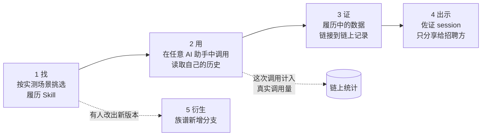

# 06 · AI 能力履历（FDE 名片）

> 一个从你的真实 session 生成"AI 能力履历"的 Skill。它用能力维度图和链上可查的数据，展示你真正解决问题的能力。它也是本项目的演示闭环。

界面示意：[mockups/ai-capability-resume.html](mockups/ai-capability-resume.html)

## 解决什么问题

- 简历上的项目经历和技能列表无法验证；粉丝数和作品集热度可以包装。
- 越来越多的工作是"和 AI 一起解决问题"，但这种能力没有可信的展示方式。
- 有能力却缺少机会的人，很难被发现。

## 定位：FDE 的终极名片

FDE（Forward Deployed Engineer，前线部署工程师）是在客户现场、直接用技术解决实际业务问题的工程师。FDE 最需要证明的不是做过哪些项目，而是解决问题的能力。AI 能力履历展示的正是这一点：

- 你在哪些领域、哪些类型的任务上真正解决过问题：来自真实 session 的场景标签和结果；
- 你沉淀的 Skill 被别人真实调用了多少次、在什么场景下好用：来自链上统计；
- 关键证据可以私密出示给招聘方，只给对方看。

## 用户看到什么

1. **找**：在 Skill tab 搜"履历"，看到不同履历 Skill 的实测场景，例如一个主要用于工程师求职，另一个主要用于设计作品集。选择适合自己的那个。
2. **用**：在 AI 编程助手里调用（阶段 1 演示用 Claude Code）。它在你的电脑上运行，通过 Obelisk 读取你自己的历史，生成能力维度图和履历。这次调用计入该 Skill 的真实调用量。
3. **证**：履历里"我沉淀的 Skill 被调用了多少次"等数据，直接链接到链上记录，招聘方可以自己核对。
4. **出示**：把佐证 session 私密分享给招聘方的钱包：只能看一次，带水印，你会收到已读回执。
5. **衍生**：有人把它改成"设计师作品集"版本并铸造，族谱上多出一个分支；收入分成以截图展示。

## 为什么有价值

- **对个人**：凭真实能力而不是包装获得机会；数据记在自己的钱包身份下，换平台也带得走。
- **对招聘方**：看到的是可核对的能力证据，不必只信简历。
- **对人才市场**：帮助有能力但缺少机会的人被发现（阶段 3 的方向）。
- **对演示**：一个场景串起本项目的全部核心功能：沉淀、铸造、场景归因、真实调用量、私密分享、族谱。

## 能力维度图

- 维度来自场景标签（技术领域、任务类型、产出物类型），每个维度展示工作量和顺利率。
- 维度数据由 Obelisk 在本机计算；只有用户决定放进履历的部分才会被导出。

## 功能拆分

| 编号 | 功能 | 用户能做什么 | 运行在哪里 | 需要 AI 吗 | 阶段 |
| --- | --- | --- | --- | --- | --- |
| R1 | 「AI 能力履历」Skill | 读取本人历史，生成能力维度图和履历 | 本机（AI 编程助手调用这个 Skill，Obelisk 提供历史数据） | 需要 | 阶段 1 |
| R2 | 链上数据引用 | 履历中的 Skill 和调用数据链接到链上记录 | 在线服务、链上、本机 | 不需要 | 阶段 1 |
| R3 | 私密出示佐证 | 把佐证 session 只分享给招聘方 | 同 [02](02-private-sharing.md) S1 至 S5 | 不需要 | 阶段 1 |
| R4 | FDE 人才市场 | 按能力维度发现人才 | 在线服务、本机（界面） | 不需要（按公开的能力维度检索） | 阶段 3 |

## 上线步骤

改动部分标记：【界面】App 界面 ·【本机】本机 Obelisk（含 App 后台）·【CLI】命令行与 agent skill ·【在线服务】·【链上】合约。

**R1 「AI 能力履历」Skill**

1. 用沉淀流程（[03](03-skill-assets.md) K1）制作「AI 能力履历」Skill，并铸造（K2）。
2. 【本机】这个 Skill 在用户的 AI 编程助手里运行，通过 Obelisk 已有的查询能力读取用户历史，结合场景标签（[04](04-real-usage-and-scenarios.md) U2）和结果判断（U3）计算各维度。
3. 【本机】生成履历文档和能力维度图。

**R2 链上数据引用**

1. 【在线服务】按钱包地址查询链上的 Skill 和使用统计。
2. 【本机】在履历中插入可以核对的链上记录链接。

**R3 私密出示佐证**

1. 复用私密分享 S1 至 S5（[02](02-private-sharing.md)）。

**R4 FDE 人才市场**

1. 【在线服务】按能力维度检索公开的履历。
2. 【界面】人才浏览页。
