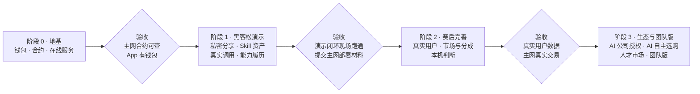
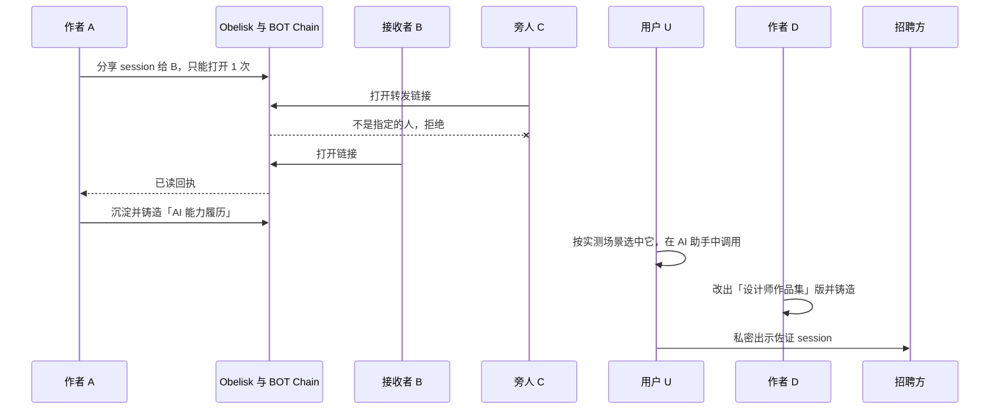

# 07 · 路线图

> 分四个阶段交付。阶段 1 是黑客松演示，提交截止时间为 2026-10-08 12:00（北京时间）。

## 阶段一览

## 阶段 0 · 地基

**目标**：身份、合约、在线服务三件基础设施就位。

**包含**：[01](01-identity-and-chain.md) I1–I4。

**验收**

- 合约部署在 BOT Chain 主网，源代码在区块浏览器上可以验证；
- App 能生成钱包并显示地址；
- 在线服务可以访问，并能代为提交一笔链上交易。

## 阶段 1 · 黑客松演示

**目标**：在现场跑通"AI 能力履历"演示闭环，提交主网部署材料；用 Playground 跑出可以说明来源的真实数据、实时页面和关键截图，作为演示材料；投资人预览页可以通过链接访问。

**现场可操作**

- 私密分享：[02](02-private-sharing.md) S1–S5，以及 S6 的常见格式识别
- Skill 资产：[03](03-skill-assets.md) K1–K5
- 真实使用：[04](04-real-usage-and-scenarios.md) U1–U5
- 能力履历：[06](06-ai-capability-resume.md) R1–R3
- Playground：[09](09-playground.md) G1–G6

**截图展示**

- 市场与收益：[05](05-market-and-revenue.md) M1、M3、M4、M5，截图标注"演示数据"
- AI 公司授权（M6）：一句话加一张示意图，讲清"Skill 正文可以复制，价值从哪里来"
- 团队版：一页愿景（[08](08-team-edition.md)）

**演示脚本**

1. **分享**：A 在 Session 详情页选好片段，填写 B 的钱包和"只能打开 1 次"，复制成 prompt；在 Claude Code 里完成隐私体检并确认分享。
2. **转发无效**：C 打开同一个链接，被拒绝。
3. **已读**：B 在网页上打开，看到带水印的对话；A 的 Share tab 显示"已读"和链上记录；B 再次打开被拒绝。
4. **沉淀与铸造**：A 在 Claude Code 里用「沉淀 Skill」说一句话，Obelisk 从 A 的历史中找出证据并展示用到的 session，起草「AI 能力履历」Skill；A 在 App 的 Skill tab 审阅草稿，复制"确认并铸造"的 prompt，在 Claude Code 里看过预览后铸造。
5. **场景与调用量**：在 Skill tab 对比两个履历 Skill 的实测场景、调用量和顺利率。数据来自 Playground 的真实运行，界面标明来源，点开可以查看产生方法。
6. **使用**：U 在 Claude Code 中调用「AI 能力履历」生成履历，这次调用计入统计。
7. **衍生**：D 在 Skill 详情页复制"在此基础上修改"的 prompt，在 Claude Code 里改出「设计师作品集」版并铸造，族谱新增分支。
8. **出示**：U 把佐证 session 私密分享给招聘方。
9. **截图**：上架、分成、收入、上下文付费；团队版愿景。

**验收**

- 演示脚本的每一步都在现场真实运行；
- 提交材料包含 BOT Chain 主网区块浏览器链接、交易记录和合约地址（赛事要求）；
- 提交材料区分赛前已有部分和比赛期间新增部分（见 [README](README.md#赛前已有与本项目新增)）。

## 阶段 2 · 赛后完善

**目标**：从演示走向真实用户。

**包含**

- 身份：I5 连接外部钱包
- 私密分享：S6 更全面的识别、S7 泄露追踪、S8 App 内接收
- Skill 资产：K1 从 App 直接发起沉淀、K6 相似提醒、K7 发布到 skills.sh
- 真实使用：U6 按场景搜索与推荐、U7 本机低成本判断
- 市场与收益：M1–M5 的实现
- Playground：G7 准确度校验

**验收**

- 真实用户（非模拟）的调用数据能够上报并展示；
- 付费解锁和分成在主网上完成真实交易；
- 场景标签和结果判断大部分改用规则和本机小模型完成，准确度用 Playground 的已知答案校验。

## 阶段 3 · 生态与团队版

**包含**：S9 只给 AI 用、M6 AI 公司授权、M7 AI 自主选购、R4 FDE 人才市场、团队版（[08](08-team-edition.md)）。

**验收**：阶段 2 完成后再制定。

## 各阶段改动范围

| 阶段 | App 界面 | 本机 Obelisk | CLI 与 agent skill | 在线服务 | 网页阅读页 | 链上 | Playground |
| --- | --- | --- | --- | --- | --- | --- | --- |
| 0 | Settings 钱包 | 钱包与签名、加密钥匙派生 | 创建钱包与激活 | 服务骨架、手续费代付、链上数据查询 | 激活页 | 密钥登记、分享授权、Skill 资产、使用统计 | 无 |
| 1 | Session 分享入口、Share tab、Skill tab、数据来源标记；操作按钮复制成 prompt | 分享打包、隐私体检、Skill 库、使用分析、交给 AI 编程助手的后台任务、指定数据目录 | 「沉淀 Skill」skill；分享、撤回、铸造、衍生、取用、上报开关命令 | 保存密文、按规则交出钥匙包、市场数据 | 阅读页、水印 | 沿用阶段 0 的合约，加入来源标注 | 模拟用户、真实闭环剧本、实时页面、关键截图、数据出处、投资人预览页 |
| 2 | 收件列表、发布到 skills.sh、场景搜索、上架与收入、从 App 发起沉淀 | 收件库、隐形指纹、本机判断、导出标准格式 | 查询收件库、泄露追踪、发布到 skills.sh、场景搜索、上架与购买 | 相似度检测、场景检索、付款后放行 | 隐形指纹 | 市场与分成 | 准确度校验 |
| 3 | 预算与购买记录、经验数据授权状态、人才浏览、团队功能 | AI 自主选购、经验数据打包 | AI 自主选购流程、经验数据授权 | AI 公司取用接口与授权管理、人才检索 | 无 | AI 公司授权 | 无 |

## 待决策

1. **后台 AI 任务的频率和额度上限**：场景标签和结果判断交给用户本机的 AI 编程助手执行，消耗用户自己的额度。多久执行一次、每天最多用多少、用户能否随时关闭？影响阶段 1 的 U2、U3 和阶段 2 的 U7。
2. **场景列表由谁维护、如何扩展**：影响不同用户的标签能否长期汇总比较。
3. **收件库的默认保留期限**：影响阶段 2 的 S8。
4. **App 钱包的主路径**：阶段 2 之后以内置钱包为主，还是以连接外部钱包为主？
5. **第二个支持的 AI 编程助手**：阶段 1 只支持 Claude Code。之后先支持 Codex 还是其他？影响「沉淀 Skill」和后台 AI 任务的适配范围。
6. **代码归属**：链上和在线服务相关的代码进入上游 Obelisk 仓库，还是保留在 fork 或独立仓库？上游 Obelisk 坚持本地优先、无网络可用，需要和维护者确认。
