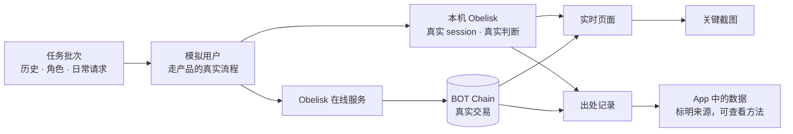

# 09 · Playground：在一台电脑上跑出真实数据

> 从本机真实历史发现有价值的 Skill，再让模拟用户真实地创建、搜索、选用、使用和衍生，持续积累市场数据。重要过程从发生时就被记录，路演故事从这些数据中发现和选取。

界面示意：[场景一 · 运行页面](mockups/playground-live.html) · [场景二 · 投资人预览页](mockups/investor-preview.html)

## 本轮数据积累方式（2026-10-08 确认）

- **真实历史是起点**：用 Obelisk 在本机已有的 session 中发现经验和纠正，形成多主题候选 Skill、出处和可审阅资产，按授权范围发布到测试网（[#45](https://github.com/KinomotoMio/obelisk-hackathon/issues/45)）。
- **模拟人做真实任务**：角色根据自己的需求搜索市场、比较候选、选择或放弃、真实调用，并在实际改进时衍生；数量和结果由真实过程产生（[#46](https://github.com/KinomotoMio/obelisk-hackathon/issues/46)）。
- **从开始就记录**：保存重要的创建、选择、使用、纠正、衍生和结算过程，形成多批次证据与素材清单（[#47](https://github.com/KinomotoMio/obelisk-hackathon/issues/47)）。
- **故事从数据中来**：运行任务的配置用于复现，不等于台上的演示剧本。可以在积累过程中发现故事，再选择真实案例用于 PPT、demo 和项目预览；大量数据不以固定九步剧情为前置（[#31](https://github.com/KinomotoMio/obelisk-hackathon/issues/31)）。

### 用户发言与诊断边界

模拟用户用自然日常请求，例如「帮我整理这个构建项目」「把这几次协作中有用的做法整理成以后能复用的东西」。不把预定的 Skill 名称、CLI、接口或操作步骤塞进用户发言来强迫触发；能力和环境由系统准备，操作者的 SOP 不写进用户嘴里。用户自然点名已知 Skill 的使用可以记录，但标明这是用户的明确选择，不能当作模型自主发现的样本。

模型没有触发 Skill、走了其他路径或没有找到合适资产，也照实记录。显式点名 Skill/命令的格式与计量校准，以及用户点击 App 操作按钮得到的明确 prompt，分别标注，不冒充自然请求的触发率或效果样本。诊断由 [#43](https://github.com/KinomotoMio/obelisk-hackathon/issues/43) 跟踪，判定工具证据的小范围修复由 [#48](https://github.com/KinomotoMio/obelisk-hackathon/issues/48) 跟踪。

## 解决什么问题

- **价值是多方的，开发只有一个人**：分享需要发送方和接收方，族谱需要原作者和衍生作者，调用统计需要很多用户。开发时只有一个人、一台电脑。
- **没有用户就没有数据**：手工编的数据说服不了任何人，也证明不了产品能落地。
- **别人需要看懂**：对外讲解时，听的人需要看到这些功能在多人之间是怎么运转的。

## 两个场景

| | 场景一：真实数据模拟 | 场景二：投资人预览页 |
| --- | --- | --- |
| 目的 | 证明能落地：产出真实数据，并说得清来源 | 让没用过产品的人快速看懂多角色的全流程 |
| 数据 | 真实运行产生：真实的 AI 运行、真实的加密、真实的链上交易；用户是模拟的 | 界面示意和演示样例，明确标注；场景一跑出真实运行后，可以换成真实截图 |
| 形态 | 本机运行，加上实时页面、关键截图和数据出处记录 | 一个独立网页，可以挂在链接下发给投资人 |
| 阶段 | 阶段 1 | 阶段 1 |

## 场景一：真实数据模拟

### 它做什么

- **模拟用户**：创建多个角色，每个角色有自己的钱包和一份独立的 Obelisk 数据，相当于不同的人。
- **持续积累真实过程**：从真实历史发现和沉淀 Skill，模拟用户搜索、选择和使用，再发生分享、衍生及汇总上报。执行器与模型使用经过本轮校准的路径，保存真实 session；收入能力完成后加入实际测试币购买和分账。每一步走真实产品路径，不绕过，不伪造。
- **实时页面**：运行时在一个页面里动态展示进度、正在发生的事件和链上交易。
- **关键截图**：运行中自动截取关键画面，例如已读回执出现、族谱新增分支、调用量更新。
- **数据出处**：每次运行生成一份出处记录。App 里由 Playground 产生的数据都标明来源，点开就能看到它是怎么产生的。

### 数据出处记录什么

| 记录项 | 内容 |
| --- | --- |
| 运行 | 运行编号、开始和结束时间、任务批次与配置 |
| 模拟用户 | 每个角色的钱包地址 |
| 任务 | 任务清单，以及每个任务覆盖的场景 |
| AI 运行 | 使用的 AI 编程助手和模型版本 |
| 产物 | 产生的 session、铸造的 Skill、链上交易 |
| 截图 | 关键画面及其对应的步骤 |

### 为什么有价值

- **真数据，不是 mock**：App 里的每一个数字都能说清是怎么来的，经得起追问。
- **证明能落地**：数据是走产品真实路径跑出来的，说明整条链路已经打通。
- **素材现成**：实时页面和关键截图可以直接用于路演、提交材料和文档。
- **准确度校验**：独立校准任务可用已知答案检验场景与结果判断；正式自然使用保留实际结果，不预设或覆盖顺利率。

## 场景二：投资人预览页

- 一个独立网页，可以挂在一个链接下发给投资人，不需要安装任何东西。
- 按角色展示全流程：作者、接收者、旁人、用户、衍生作者、招聘方各自看到什么，链上发生了什么。
- 页面上的界面和数据是示意，并明确标注；场景一跑出真实运行后，换成真实截图和真实数据，并附出处。

## 运行环境

- 开发调试在 BOT Chain 测试网运行（Chain ID 968，测试币从官方水龙头免费领取）。
- 本轮对外展示的数据在测试网真实运行，页面和材料明确标注测试网、模拟角色和真实 AI 运行；测试币结算不作为实际营收。
- 测试网验收后固定代码版本，再用同一版本部署主网并跑少量真实业务验证。主网和测试网使用独立的 Worker 服务，主网不重复生成整批演示数据，见 [本轮执行顺序](07-roadmap.md#本轮执行顺序2026-10-08-确认)。

## 功能拆分

| 编号 | 功能 | 能做什么 | 运行在哪里 | 需要 AI 吗 | 阶段 |
| --- | --- | --- | --- | --- | --- |
| G1 | 模拟用户 | 在一台电脑上创建多个角色，各有钱包和独立的 Obelisk 数据，一键切换 | 本机 | 不需要 | 阶段 1 |
| G2 | 真实任务与数据积累 | 从历史发现资产，模拟搜索、选择、真实使用和衍生，按批次保留结果 | 本机（Playground、AI 编程助手、Obelisk）、在线服务、链上 | 需要（任务由 AI 编程助手真实执行） | 阶段 1 |
| G3 | 实时页面 | 运行时动态展示进度、事件和链上交易 | 本机 | 不需要 | 阶段 1 |
| G4 | 关键截图 | 运行中自动截取关键画面 | 本机 | 不需要 | 阶段 1 |
| G5 | 数据出处 | 每次运行生成出处记录；App 中的数据标明来源，可以查看产生方法 | 本机、在线服务、链上 | 不需要 | 阶段 1 |
| G6 | 投资人预览页 | 独立网页，按角色展示全流程 | 网页 | 不需要 | 阶段 1 |
| G7 | 准确度校验 | 用剧本预设结果检验场景标签和结果判断 | 本机 | 不需要（比对已有结果） | 阶段 2 |

## 上线步骤

改动部分标记：【工具】Playground 本身（独立脚本与页面）·【界面】App 界面 ·【本机】本机 Obelisk ·【在线服务】·【网页】独立网页 ·【链上】合约。

**G1 模拟用户**

1. 【本机】让 App 和 CLI 可以使用指定的数据目录运行。目前 Obelisk 的数据固定存放在用户主目录下。
2. 【工具】角色管理：为每个角色生成钱包、准备独立的数据目录，并支持一键切换。

**G2 真实任务与数据积累**

1. 【工具】运行任务配置：历史范围、角色需求、批次、预算及可复现的实际操作；沿用现有 scenario/run 能力，和路演故事分开。
2. 【工具】执行器：角色在 AI 编程助手里提出自然请求，由模型决定是否检索、选择或调用 Skill；没有发生的调用不能补数，也不直接改写产品数据。
3. 【工具】真实 AI 运行：每个角色使用独立工作区、数据和钱包，执行器和模型经过 #43 校准；真实 session 和结果进入对应数据目录。
4. 【工具】历史发现、资产发布、市场使用和素材记录分别积累；路演可以在过程中选择并复现有价值的片段，但不先限定所有任务为同一条固定故事。

**G3 实时页面**

1. 【工具】接收运行中的事件和链上交易，在一个页面里按时间动态展示。

**G4 关键截图**

1. 【工具】在剧本标记的关键步骤，自动截取相关角色的界面，并与步骤对应保存。

**G5 数据出处**

1. 【工具】每次运行生成出处记录（内容见上表）。
2. 【链上】使用统计等记录可以标注"来自 Playground 运行"。
3. 【在线服务】市场数据区分来源。
4. 【界面】数据旁显示来源标记，点开可以查看对应的出处记录。

**G6 投资人预览页**

1. 【网页】按角色展示全流程的独立网页，示意内容明确标注。
2. 【网页】场景一产出真实运行后，替换为真实截图和数据，并附出处。

**G7 准确度校验**

1. 【工具】把剧本预设结果与场景标签、结果判断（[04](04-real-usage-and-scenarios.md) U2、U3）的输出逐条比对，给出准确度。

## 已知限制

- 场景一的用户是模拟的。它证明链路真实可用、数据产生方法可以说明，但不代表真实的市场规模。真实用户的数据从阶段 2 开始积累。
