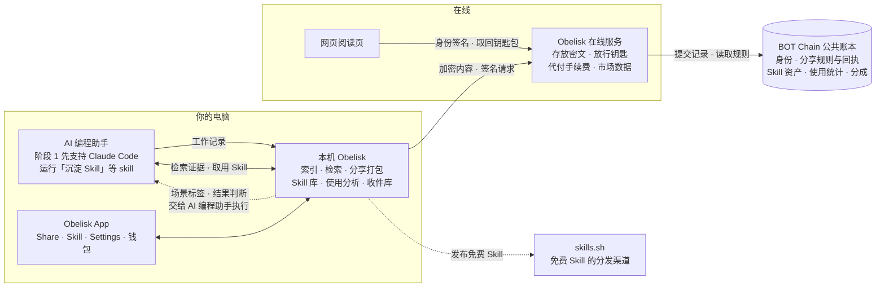

# Obelisk × BOT Chain：让 AI 工作经验可分享、可计量、可交易

> Obelisk 把你和 AI 一起工作的真实记录，变成两样东西：只给一个人看的经验，以及用真实数据证明价值的 Skill 资产。

## 怎么读这组文档

- 只想知道我们在做什么、为什么值得做：读本页。
- 想看某个功能：按下方「功能地图」进入对应文档。每个功能文档的结构相同：解决什么问题 → 用户看到什么 → 为什么有价值 → 功能拆分 → 上线步骤。
- 想知道先做什么、后做什么：读[路线图](07-roadmap.md)。
- 想直观看到界面：打开 [mockups](mockups/) 里的 HTML 界面示意（私密分享、Skill 详情、市场与收益、AI 能力履历、Playground 运行、投资人预览），每个文件可以单独用浏览器打开。

这组文档讲价值和功能，工程实现细节之后单独讨论。

## Obelisk 今天是什么

开发者越来越多地和 AI 编程助手（Claude Code、Codex 等）一起工作。每次工作都会留下一份完整记录，叫 **session**：你说了什么，AI 读了哪些文件、改了什么、运行了什么命令。

Obelisk 把这些 session 收集到你自己电脑上的一个数据库里。你的 AI 可以查询这些历史，回答"上次那个 bug 是怎么修的"；你也可以在 Obelisk 桌面 App 里浏览。以上能力在本项目开始前已经存在。

## 为谁做

| 用户 | 需要什么 |
| --- | --- |
| 和 AI 编程助手一起工作的开发者 | 安全地分享经验；把反复验证过的做法沉淀成 Skill；用真实数据证明自己的能力，并从中获得收入 |
| Skill 的使用者和买家 | 在付费和使用之前，知道一个 Skill 在自己的场景下是否真的好用 |
| 招聘方，以及需要 FDE 的团队 | 看到候选人可以核对的能力证据，而不只是简历 |
| AI 公司与团队（阶段 3） | 合规地取用持续更新的社区 Skill 和带出处的真实经验数据；团队内部的经验沉淀、权限与审计 |

## 我们要解决的两个问题

### 一、想分享经验，但分享就等于泄露

一次 session 里有很多有价值的东西：一个难 bug 是怎么修好的，一个方案为什么这么选。但它也混着代码、内部路径和密钥。今天想分享，只能发文件或截图：

- 发出去就收不回来；
- 对方可以随手转给任何人；
- 你不知道对方有没有看、还有谁看过。

### 二、Skill 市场靠描述和流量，买家无法判断真假

**Skill** 是给 AI 的一份"做事方法说明书"。它已经有了公开的目录和排行榜，开始像商品一样被分发和比较。但现有的 Skill 目录按安装量排名（例如 skills.sh 的排行榜基于匿名安装统计，不收集使用情况，见[其 FAQ](https://www.skills.sh/docs/faq)），说明文字由作者自己写。

作者为了推广，自然会把适用范围写得尽量宽；安装量和粉丝数也可以买。买家不知道一个 Skill 实际在什么场景下好用，用了之后效果如何。

## 我们的做法

### 私密分享：只给 TA 看

- 分享给一个钱包地址，只有这个钱包能打开；链接被转发，别人打不开。
- 可以设定只能打开一次、限时有效、随时撤回；对方打开后，你收到已读回执。
- 阅读页印着接收者身份的水印，截图外泄能追溯到是哪一份。
- 内容在你的电脑上加密后才离开；在线服务和 Obelisk 团队都看不到内容。

### Skill 资产化：用真实数据说话

- **沉淀**：说一句话，Obelisk 就从你的全部历史里找出直接证据，整理成 Skill，并附上出处。它检索的是完整的 session 原文而不是摘要，这是它相对其他记忆工具的天然优势。
- **铸造**：把 Skill 登记到链上，成为有唯一编号、记录作者的数字资产（即 NFT）。
- **真实调用量**：Obelisk 本来就记录 AI 每次调用 Skill，所以统计的是真实调用次数，不是安装量。
- **场景归因**：从 session 中归纳 Skill 实际在什么场景下被使用、效果如何，和作者自己写的描述并排展示。
- **族谱与分成**：谁在谁的基础上改出了新 Skill，链上一目了然；收入按规则自动分给上游作者。
- **上下文付费**：不只卖 Skill（方法），也卖一段真实 session（经验）。

### 钱包就是你的数字身份

钱包是一个由你自己掌握的账户地址：不用注册，也不属于任何平台。你做过哪些 Skill、被真实调用了多少次、赚了多少钱，都记在这个身份下，换平台也带得走。粉丝和流量都可以花钱买到，这些数据却很难造假，是更有说服力的能力证明。

## 为什么要用区块链

| 我们需要的 | 只用自己服务器的问题 | 区块链提供的 |
| --- | --- | --- |
| 分享规则可信：谁能看、能看几次、何时失效 | 规则存在平台数据库里，平台可以随时修改 | 规则和打开回执写在公共账本上，任何人可查，包括我们在内都无法私自改写 |
| 身份和成绩不被平台锁定 | 换一个平台，记录和声誉都带不走 | 记在你的钱包地址下，任何应用都能读取同一份数据 |
| 族谱和分成可信 | 平台可以删改衍生关系、拖欠分成 | 族谱公开且不可篡改；分成由链上程序在付款时自动执行 |

链上只放规则、凭证、计数和标签。session 和 Skill 的内容不上链。

我们部署在 **BOT Chain**：一条面向 AI Agent 的公链，兼容以太坊的开发工具（主网 Chain ID 677）。

## 整体架构

- **你的电脑**：AI 编程助手照常工作，本机 Obelisk 记录并分析 session。分享内容在这里打包、打码、加密；Skill 在这里沉淀和取用；调用统计在这里计算。原始 session 不会被上传。
- **AI 编程助手**：所有需要 AI 的工作都交给用户本机的 AI 编程助手执行，阶段 1 先支持 Claude Code。我们不另外接入模型服务。
- **Obelisk 在线服务**：只保管加密后的内容。它按链上规则决定是否把钥匙包交给接收者，替用户支付链上手续费，并为 App 和网页整理市场数据。在线服务不做任何需要 AI 的工作。
- **网页阅读页**：没有安装 Obelisk 的人，用浏览器和钱包打开分享。
- **BOT Chain**：公共账本，记录身份、分享规则与回执、Skill 资产、使用统计和分成规则。
- **skills.sh**：免费 Skill 可以一键发布到这里，进入更大的分发渠道。

## 哪些能力在哪里运行、哪些需要 AI

每个功能文档的功能拆分表都有"运行在哪里"和"需要 AI 吗"两列。总体如下：

| 运行在哪里 | 做什么 | 需要 AI 吗 |
| --- | --- | --- |
| 本机 · AI 编程助手 | 沉淀 Skill、场景标签、结果判断、AI 能力履历、Playground 中的真实 AI 运行 | 需要。由用户本机的 AI 编程助手执行，费用走用户自己的订阅 |
| 本机 · Obelisk | 索引与检索、识别 Skill 调用、事实信号统计、隐私体检（常见格式）、打码与加密、Skill 库、收件库、钱包与签名 | 不需要 |
| 在线服务 | 保存密文、按链上规则交出钥匙包、代付手续费、市场数据、相似度检测 | 不需要 |
| 链上 | 密钥登记、分享授权与回执、Skill 资产、使用统计、市场与分成 | 不需要 |
| 网页 | 网页阅读页、水印、投资人预览页 | 不需要 |

用户主动发起的 AI 能力做成独立的 skill，例如「沉淀 Skill」，在 AI 编程助手里调用。这样触发更准确，完整流程也写在 skill 里。后台需要 AI 的工作（场景标签、结果判断）由 Obelisk 交给本机的 AI 编程助手批量执行。

## 功能地图

| 领域 | 包含的功能 | 文档 | 首次上线 |
| --- | --- | --- | --- |
| 身份与链上账本 | 内置钱包、加密公钥登记、链上合约、手续费代付 | [01](01-identity-and-chain.md) | 阶段 0 |
| 私密分享 | 指定钱包可读、打开规则、已读回执、网页阅读页、水印、隐私体检、泄露追踪、App 内接收 | [02](02-private-sharing.md) | 阶段 1 |
| Skill 沉淀与资产化 | 从 session 沉淀、铸造、衍生与族谱、Skill tab、相似提醒、发布到 skills.sh | [03](03-skill-assets.md) | 阶段 1 |
| 真实使用与场景归因 | 识别调用、场景标签、结果判断、汇总上报、描述与实测并排 | [04](04-real-usage-and-scenarios.md) | 阶段 1 |
| 市场与收益 | 上架、付费解锁、上下文付费、分成、收入面板、AI 公司授权；Skill 正文可以复制，价值从哪里来 | [05](05-market-and-revenue.md) | 阶段 1 以截图展示，阶段 2 实现 |
| AI 能力履历 | 生成能力履历的 Skill，演示闭环 | [06](06-ai-capability-resume.md) | 阶段 1 |
| 团队版 | 团队技能库、权限、度量、治理与采购 | [08](08-team-edition.md) | 阶段 3 |
| Playground | 在一台电脑上让模拟用户走真实闭环，跑出可说明来源的真实数据；投资人预览页 | [09](09-playground.md) | 阶段 1 |

## 设计原则

- **本地优先**：session 原文只在用户主动分享时离开本机，而且始终加密。没有网络时 Obelisk 照常可用；链上功能由用户自己开启。
- **链上不放内容**：只放规则、凭证、计数和标签。
- **AI 工作交给本机的 AI 编程助手**：不另外接入模型服务。用户主动发起的能力做成独立的 skill；后台任务由 Obelisk 交给本机的 AI 编程助手批量执行。
- **事实与推断分开**：报错次数、被纠正次数是事实；"顺利 / 失败"是模型判断，界面上要标出样本数和无法判断的比例。
- **别人的记忆不是你的记忆**：收到的分享单独存放，默认不进入检索；只有用户明确要求时才查询。

## 赛前已有与本项目新增

| 能力 | 赛前已有 | 本项目新增 |
| --- | --- | --- |
| Session 索引与检索 | Claude Code、Codex、DeepSeek Harness、Kimi Code、OMP、Pi 的 session 索引进同一个本地数据库；AI 通过 CLI 和 skill 检索 | 不改动，作为所有新功能的数据来源 |
| 记忆 | 人工确认的 markdown 记忆，可撤销 | Obelisk 原生 Skill 复用同样的"登记 + 读取"方式 |
| Skill 调用记录 | 索引已记录每次调用的 skill 名称和当时加载的 Skill 全文；工具报错也已记录 | 按内容指纹识别版本，统计真实调用量、场景和结果 |
| 桌面 App | Sessions、Memory、Activity、Recaps、Settings | 新增 Share、Skill 两个 tab；Session 详情页新增分享入口；Settings 新增钱包 |
| Session 分享 | 无（设计讨论见 #64、#71） | 加密分享、打开规则、已读回执、水印、网页阅读页 |
| Skill 沉淀 | 无（方向见 #118） | 从 session 起草 Skill，附出处和出生场景 |
| 链上与在线服务 | 无 | BOT Chain 合约、Obelisk 在线服务 |
