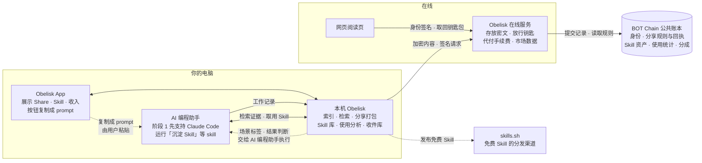

# Obelisk × BOT Chain：让 AI 工作经验可分享、可计量、可交易

> Obelisk 把你和 AI 一起工作的真实记录，变成两样东西：只给一个人看的经验，以及用真实数据证明价值的 Skill 资产。

## 怎么读这组文档

- 只想知道我们在做什么、为什么值得做：读本页。
- 想看某个功能：按下方「功能地图」进入对应文档。每个功能文档的结构相同：解决什么问题 → 用户看到什么 → 为什么有价值 → 功能拆分 → 上线步骤。
- 想知道先做什么、后做什么：读[路线图](07-roadmap.md)。
- 想直观看到界面：打开 [mockups](mockups/) 里的 HTML 界面示意（私密分享、Skill 详情、市场与收益、AI 能力履历、Playground 运行、投资人预览），每个文件可以单独用浏览器打开。
- 准备路演：开场用不到一分钟讲清 [Obelisk 是什么](#obelisk-是什么一分钟版)，再用[入口与出口](#入口与出口为什么由-obelisk-来做)说明新旧工作如何相互证明；收尾取材于[愿景：知识付费 2.0](#愿景知识付费-20)。
- 想知道会被怎样质疑、我们怎么回应：读[质疑与回应](10-challenges.md)。
- 想了解 Obelisk 本身的出发点：读[为什么是 Obelisk](why-obelisk.md)（Obelisk 官网博客原文的副本）。

这组文档讲价值和功能，工程实现细节之后单独讨论。

## Obelisk 是什么（一分钟版）

以下是本项目开始前已经存在的 Obelisk。

- **记录早就在了，只是够不着**：AI 编程助手会把每一场对话（session）原样存在硬盘上，但记录按坐标归档：哪一天、哪个项目、哪个工具；而人按判断记事："我们当时决定不那么做"。Obelisk 把整台电脑上所有 AI 编程助手、所有项目的 session 索引到本机，让你和你的 AI 在想知道的那一刻就能找到。
- **值钱的是判断，尤其是否定性的判断**：你纠正 AI 的那些时刻，留下了你接受什么、不接受什么。Obelisk 不替你决定该记住什么、该忘掉什么，工作时也不用点"保存"；事后一句话，就能从全部原文中找回直接证据。
- **对话是证据，不是答案**：经你批准的结论才成为记忆，并且始终连着出处。

完整论述见 [为什么是 Obelisk](why-obelisk.md)。

## 入口与出口：为什么由 Obelisk 来做

Obelisk 是一个很好的入口：判断被完整地收进来，找得到，也能沉淀成 Skill。本项目做的是出口：把这些判断分享给别人，变成资产，并在别人手里被验证。出口之所以可信，是因为入口本来就扎实；出口跑出来的数据，又反过来证明入口的价值。

| 这次新做的（出口） | 依靠 Obelisk 已有的（入口） | 反过来证明了什么 |
| --- | --- | --- |
| 一句话沉淀 Skill | 检索完整的 session 原文，而不是摘要过的记忆 | 沉淀出的 Skill 在别人手里的调用量和顺利率，说明 Obelisk 找回的判断确实有用 |
| 真实调用量 | 索引本来就记录每次 Skill 调用，以及当时加载的全文 | 只有完整的记录才能计量真实使用，说明"全部记下来、事后再找"这条路是对的 |
| 场景归因 | 每次调用所在的 session 都在索引里 | 同一个 Skill 在不同场景下表现不同，只有原始过程才看得出来 |
| 私密分享与上下文付费 | 完整、可检索的 session，加上分享前的隐私体检 | 有人愿意为一段原始 session 付费，说明原始过程比总结更值钱 |
| AI 能力履历 | 跨项目、跨工具的全部历史 | 能力的证据来自真实工作，而不是包装 |

跨出自己的电脑，还有一个前提会变。Obelisk 索引整台机器之所以站得住，是因为那是你自己的历史，在你自己的机器上，归你掌控；换成共享的历史，这条论证就不成立。分享出去的判断需要新的规则：给谁看、能看几次、谁说了算，价值又怎么算。这正是本项目引入钱包身份和公共账本的原因。

## 为谁做

| 用户 | 需要什么 |
| --- | --- |
| 和 AI 编程助手一起工作的开发者 | 安全地分享经验；把反复验证过的做法沉淀成 Skill；用真实数据证明自己的能力，并从中获得收入 |
| Skill 的使用者和买家 | 在付费和使用之前，知道一个 Skill 在自己的场景下是否真的好用 |
| 招聘方，以及需要 FDE 的团队 | 看到候选人可以核对的能力证据，而不只是简历 |
| AI 公司与团队（阶段 3） | 合规地取用持续更新的社区 Skill 和带出处的真实经验数据；团队内部的经验沉淀、权限与审计 |

## 我们看到的问题

先用一句话说，每一条都是反复出现的现象：

| 你一定见过 | 问题出在哪 |
| --- | --- |
| 收藏了一堆爆款 Skill，真正用起来的没几个 | 市场按流量排名，不按真实效果排名。流量能买，效果没人数 |
| 评分最高的那个前端 Skill，其实是给电商后台写的 | 描述是作者自己写的，一定往宽了写；没有人知道它实际适合什么场景 |
| 截图发到群里，第二天出现在了别的群里 | 经验一旦分享就失控，于是最有价值的经验只能留在自己电脑里 |
| 自己的 Skill 被人改个名字又发了一遍 | 文本复制零成本，作者证明不了归属，也分不到衍生作品的收益 |
| 简历上写着"擅长和 AI 协作"，面试官没法验证 | 真正解决问题的能力没有可信的证明，有能力的人不被发现 |

下面逐条拆开。

### 一、AI 能力市场在割韭菜：流量可以买，效果没人数

现在是流量时代。判断一个人、一个 Skill 有没有价值，看的是粉丝数、订阅数、安装量、星标，而这些都可以花钱买到。

- **排名看安装量**：Skill 已经有了公开的目录和排行榜，开始像商品一样被分发和比较。但排行按安装量排，例如 skills.sh 的排行榜基于匿名安装统计，不收集使用情况（见[其 FAQ](https://www.skills.sh/docs/faq)）。装了不等于用了，用了不等于好用。
- **市场奖励营销**：会包装的人排在前面，真正好用的东西不一定被看见。买家为流量付费，买回来发现不适合自己，这就是割韭菜。
- **做出好东西的人反而证明不了自己**：他们手里也只有安装量和粉丝数这类可以被买到的数字。
- **为什么一直没人解决**：一个 Skill 好不好用，证据在每个使用者自己的 session 里。市场方看不到这些 session；就算平台自己统计，用户也只能选择相信平台。

### 二、选不对：描述是作者写的，一定会夸大

假设有 10 个人写了不同的前端 Skill，而前端的场景非常多：电商后台、商业官网、创意 PPT……

- 作者希望推广，不会把描述写得和实际适用的场景一一对应，更不会写得更窄、更准。他一定往宽了写。
- 你找到一个分数很高的 Skill，结果它是给电商后台写的，而你要的是做创意 PPT 的。现在没有办法提前分辨。
- 所以使用者不应该相信描述。真正有用的信息是：这个 Skill 当初是在什么场景里做出来的，别人实际在什么场景里用它、效果如何。今天没有任何地方能回答这个问题。

### 三、好经验流不动：分享就等于泄露

一次 session 里最有价值的是判断：一个方案为什么这么选，哪条路走不通，你在哪里纠正了 AI。这些几乎从不会被写成文档。但 session 也混着代码、内部路径和密钥。今天想分享，只能发文件或截图：

- 发出去就收不回来；
- 对方可以随手转给任何人；
- 你不知道对方有没有看、还有谁看过。

对大多数人来说，首先关心的是"能不能做到只给一个人看，而且这件事可信"。做不到，人们就不敢分享。于是最有价值的东西，也就是完整的过程，留在了个人电脑里；对外流动的，只剩被压缩过的总结和截图。

### 四、创作者拿不到回报

- Skill 是文本，复制成本为零。别人改个名字再发一遍，作者无法证明"这是我先做的"。
- 别人在你的基础上做了改进，你不知道，也和你没有关系。
- AI 公司大规模使用社区创作的 Skill，创作者什么也拿不到。

### 五、真正的能力证明不了

- 简历上的项目经历和技能列表无法验证，作品集和粉丝数可以包装。
- 越来越多的工作是"和 AI 一起解决问题"，但这种能力没有可信的展示方式。FDE（Forward Deployed Engineer，在客户现场直接用技术解决业务问题的工程师）最需要证明的，恰恰是解决问题的能力。
- 有能力却缺少机会的人，很难被发现。

## 我们的做法

| 问题 | 我们的做法 | 文档 |
| --- | --- | --- |
| 流量可以买，效果没人数 | 统计真实调用量：Obelisk 本来就记录 AI 每次调用 Skill 以及当时加载的全文 | [04](04-real-usage-and-scenarios.md) |
| 描述一定会夸大 | 场景归因：从 session 中统计 Skill 实际在什么场景下被用、效果如何，和描述并排展示 | [04](04-real-usage-and-scenarios.md) |
| 分享就等于泄露 | 私密分享：只给指定的钱包看，限次、限时、可撤回、有已读回执，泄露可追溯 | [02](02-private-sharing.md) |
| 创作者拿不到回报 | 铸造、族谱与分成：归属和衍生关系记在链上，收入按规则自动分给上游；AI 公司按用量付费 | [03](03-skill-assets.md)、[05](05-market-and-revenue.md) |
| 能力证明不了 | AI 能力履历：用真实 session 和链上可查的数据展示解决问题的能力 | [06](06-ai-capability-resume.md) |

### 私密分享：只给 TA 看

- 分享给一个钱包地址，只有这个钱包能打开；链接被转发，别人打不开。
- 可以设定只能打开一次、限时有效、随时撤回；对方打开后，你收到已读回执。
- 阅读页印着接收者身份的水印，截图外泄能追溯到是哪一份。
- 内容在你的电脑上加密后才离开；在线服务和 Obelisk 团队都看不到内容。

### Skill 资产化：用真实数据说话

- **沉淀**：工作时不需要点"保存"。事后说一句话，Obelisk 就从你的全部历史里找回那些当时不知道值得留下的判断，整理成 Skill，并附上出处。它检索的是完整的 session 原文而不是摘要过的记忆，所以能找到直接证据，包括你纠正 AI 的那些时刻。
- **铸造**：把 Skill 登记到链上，成为有唯一编号、记录作者的数字资产（即 NFT）。
- **真实调用量**：Obelisk 本来就记录 AI 每次调用 Skill，所以统计的是真实调用次数，不是安装量。
- **场景归因**：从 session 中归纳 Skill 实际在什么场景下被使用、效果如何，和作者自己写的描述并排展示。
- **族谱与分成**：谁在谁的基础上改出了新 Skill，链上一目了然；收入按规则自动分给上游作者。
- **上下文付费**：不只卖 Skill（方法），也卖一段真实 session（经验）。

### 钱包就是你的数字身份

钱包是一个由你自己掌握的账户地址：不用注册，也不属于任何平台。你做过哪些 Skill、被真实调用了多少次、赚了多少钱，都记在这个身份下，换平台也带得走。粉丝和流量都可以花钱买到，这些数据却很难造假，是更有说服力的能力证明。

## 为什么要用区块链

| 我们需要的 | 只用自己服务器的问题 | 区块链提供的 |
| --- | --- | --- |
| 分享规则可信：谁能看、能看几次、何时失效 | 规则存在平台数据库里，平台可以随时修改 | 规则和打开回执写在公共账本上，任何人可查，包括我们在内都无法私自改写 |
| 身份和成绩不被平台锁定 | 换一个平台，记录和声誉都带不走 | 记在你的钱包地址下，任何应用都能读取同一份数据 |
| 族谱和分成可信 | 平台可以删改衍生关系、拖欠分成 | 族谱公开且不可篡改；分成由链上程序在付款时自动执行 |

链上只放规则、凭证、计数和标签。session 和 Skill 的内容不上链。

我们部署在 **BOT Chain**：一条面向 AI Agent 的公链，兼容以太坊的开发工具（主网 Chain ID 677）。

## 整体架构

- **你的电脑**：AI 编程助手照常工作，本机 Obelisk 记录并分析 session。分享内容在这里打包、打码、加密；Skill 在这里沉淀和取用；调用统计在这里计算。原始 session 不会被上传。
- **AI 编程助手**：用户在这里说一句话，就能通过 Obelisk 完成分享、沉淀、铸造、取用等操作。所有需要 AI 的工作也交给它执行，阶段 1 先支持 Claude Code。我们不另外接入模型服务。
- **Obelisk App**：负责展示，包括分享状态、Skill、调用数据和收入。App 上的操作按钮会复制一段 prompt，由用户粘贴到 AI 编程助手里执行。
- **Obelisk 在线服务**：只保管加密后的内容。它按链上规则决定是否把钥匙包交给接收者，替用户支付链上手续费，并为 App 和网页整理市场数据。在线服务不做任何需要 AI 的工作。
- **网页阅读页**：没有安装 Obelisk 的人，用浏览器和钱包打开分享。
- **BOT Chain**：公共账本，记录身份、分享规则与回执、Skill 资产、使用统计和分成规则。
- **skills.sh**：免费 Skill 可以发布到这里，进入更大的分发渠道。

## 哪些能力在哪里运行、哪些需要 AI

每个功能文档的功能拆分表都有"运行在哪里"和"需要 AI 吗"两列。总体如下：

| 运行在哪里 | 做什么 | 需要 AI 吗 |
| --- | --- | --- |
| 本机 · AI 编程助手 | 沉淀 Skill、场景标签、结果判断、AI 能力履历、Playground 中的真实 AI 运行 | 需要。由用户本机的 AI 编程助手执行，费用走用户自己的订阅 |
| 本机 · Obelisk | CLI 命令（命令行工具，AI 编程助手直接调用；分享、铸造、取用、上报等）、索引与检索、识别 Skill 调用、事实信号统计、隐私体检（常见格式）、打码与加密、Skill 库、收件库、钱包与签名 | 不需要 |
| 本机 · App | 展示分享状态、Skill、调用数据和收入；操作按钮复制成 prompt | 不需要 |
| 在线服务 | 保存密文、按链上规则交出钥匙包、代付手续费、市场数据、相似度检测 | 不需要 |
| 链上 | 密钥登记、分享授权与回执、Skill 资产、使用统计、市场与分成 | 不需要 |
| 网页 | 网页阅读页、水印、投资人预览页 | 不需要 |

用户主动发起的 AI 能力做成独立的 skill，例如「沉淀 Skill」，在 AI 编程助手里调用。这样触发更准确，完整流程也写在 skill 里。后台需要 AI 的工作（场景标签、结果判断）由 Obelisk 交给本机的 AI 编程助手批量执行。

## 功能地图

| 领域 | 包含的功能 | 文档 | 首次上线 |
| --- | --- | --- | --- |
| 身份与链上账本 | 内置钱包、加密公钥登记、链上合约、手续费代付 | [01](01-identity-and-chain.md) | 阶段 0 |
| 私密分享 | 指定钱包可读、打开规则、已读回执、网页阅读页、水印、隐私体检、泄露追踪、App 内接收 | [02](02-private-sharing.md) | 阶段 1 |
| Skill 沉淀与资产化 | 从 session 沉淀、铸造、衍生与族谱、Skill tab、相似提醒、发布到 skills.sh | [03](03-skill-assets.md) | 阶段 1 |
| 真实使用与场景归因 | 识别调用、场景标签、结果判断、汇总上报、描述与实测并排 | [04](04-real-usage-and-scenarios.md) | 阶段 1 |
| 市场与收益 | 上架、付费解锁、上下文付费、分成、收入面板、AI 公司授权；Skill 正文可以复制，价值从哪里来 | [05](05-market-and-revenue.md) | 阶段 1 以截图展示，阶段 2 实现 |
| AI 能力履历 | 生成能力履历的 Skill，演示闭环 | [06](06-ai-capability-resume.md) | 阶段 1 |
| 团队版 | 团队技能库、权限、度量、治理与采购 | [08](08-team-edition.md) | 阶段 3 |
| Playground | 在一台电脑上让模拟用户走真实闭环，跑出可说明来源的真实数据；投资人预览页 | [09](09-playground.md) | 阶段 1 |

## 愿景：知识付费 2.0

Skill 是知识。上下文（session）是更原始的知识，保留了最纯粹的味道：真实的决定、真实的拒绝，你说出"不，不是这样"的那一刻。

今天的知识付费卖的是成品：一门课、一篇文章、一个视频。成品在制作和被解读时都经过大量压缩：当时怎么想的、试过哪些路、在哪里被纠正，大多没有留下来。我们不在意你产出了什么视频，我们在意这个视频是怎么来的。session 恰好完整记录了"怎么来的"。

越来越多的知识由 AI 直接读取和使用。AI 不需要别人替它压缩。有人会说 Skill 是精心加工过的内容，所以比原始记录更有价值；但加工的原料正是原始过程，从大量原始过程中可以提炼出更好的 Skill（见 [03 · 一句话沉淀 Skill](03-skill-assets.md)）。原料越完整，提炼出来的 Skill 越好。

| | 知识付费 1.0 | 知识付费 2.0 |
| --- | --- | --- |
| 卖什么 | 成品：课程、文章、视频 | 过程：Skill（提炼过的方法）和上下文（原始的 session） |
| 信息 | 制作和解读时层层压缩 | 保留完整过程，包括试错和被纠正的地方 |
| 谁来用 | 人看 | 人看，也直接交给 AI 用 |
| 怎么判断值不值 | 销量、评分、粉丝数 | 真实调用量、实测场景和顺利率 |
| 钱怎么分 | 平台按销量结算 | 按真实使用结算，沿族谱分给每一个贡献者 |
| 外流了怎么办 | 很难追究 | 每份指定接收者，带水印和指纹，可以追溯 |

本项目做的，是知识付费 2.0 需要的几块基础：过程能安全地流动（[私密分享](02-private-sharing.md)），价值按真实使用计量（[真实使用](04-real-usage-and-scenarios.md)），贡献沿族谱得到回报（[市场与收益](05-market-and-revenue.md)）。

如果这件事能一起做成，知识就能在 AI 时代的信息高速公路上真正流动起来。

## 设计原则

- **本地优先**：session 原文只在用户主动分享时离开本机，而且始终加密。没有网络时 Obelisk 照常可用；链上功能由用户自己开启。
- **链上不放内容**：只放规则、凭证、计数和标签。
- **AI 工作交给本机的 AI 编程助手**：不另外接入模型服务。用户主动发起的能力做成独立的 skill；后台任务由 Obelisk 交给本机的 AI 编程助手批量执行。
- **CLI 优先，App 负责展示**：所有操作先做成 Obelisk 的 CLI 命令并写进 agent skill 文档，用户在 AI 编程助手里说一句话就能完成。App 负责展示；App 上的操作按钮在阶段 1 都是"复制成 prompt"：点击后复制一段指令，粘贴到 AI 编程助手里执行。这沿用现有 Recaps 页的做法：点"生成"会复制 `/obelisk recap this week`，交给 Claude Code 执行，结果自动出现在 App 里。以后需要精细交互时，再把按钮做成直接执行。例外有两个：没有安装 Obelisk 的接收方使用网页阅读页，那里的按钮直接执行；导入钱包要输入私钥或助记词，不能经过对话，在 App 里直接完成。
- **先预览，再确认**：会花钱、写上链或把内容发给别人的命令，先给出预览，用户明确确认后才执行。AI 自主选购（[05](05-market-and-revenue.md) M7）只在用户事先设定的预算内进行。
- **敏感信息不进对话**：隐私体检在 CLI 输出中只显示检出项的类型和位置，不显示原值；钱包私钥只保存在系统钥匙串里，不会出现在对话中。
- **核心查询不评判，产品层按需评判**：Obelisk 的查询能力不对你的判断排序、不评好坏，这一点不变。顺利率、能力维度这类评价属于产品层，服务于买家选 Skill、招聘方看能力等具体场景。
- **事实与推断分开**：报错次数、被纠正次数是事实；"顺利 / 失败"是模型判断，界面上要标出样本数和无法判断的比例。
- **对话是证据，不是答案；记忆是透镜，不是命令**：沿用 Obelisk 原有的立场。沉淀出的 Skill 附出处卡，可以回到支撑它的 session；没有用户确认，什么都不会被写入或铸造。
- **别人的历史不是你的历史**：索引整台机器的前提是"这是你自己的历史"，收到的分享不满足这个前提。所以收到的分享单独存放，默认不进入检索；只有用户明确要求时才查询，结果标明来自他人。

## 赛前已有与本项目新增

| 能力 | 赛前已有 | 本项目新增 |
| --- | --- | --- |
| Session 索引与检索 | Claude Code、Codex、DeepSeek Harness、Kimi Code、OMP、Pi 的 session 索引进同一个本地数据库；AI 通过 CLI 和 skill 检索 | 不改动，作为所有新功能的数据来源 |
| 记忆 | 人工确认的 markdown 记忆，可撤销 | Obelisk 原生 Skill 复用同样的"登记 + 读取"方式 |
| Skill 调用记录 | 索引已记录每次调用的 skill 名称和当时加载的 Skill 全文；工具报错也已记录 | 按内容指纹识别版本，统计真实调用量、场景和结果 |
| 桌面 App | Sessions、Memory、Activity、Recaps、Settings；Recaps 页的"生成"复制 `/obelisk recap` 命令，交给 Claude Code 执行 | 新增 Share、Skill 两个 tab；Session 详情页新增分享入口；Settings 新增钱包；操作按钮沿用"复制成 prompt" |
| Session 分享 | 无（设计讨论见 #64、#71） | 加密分享、打开规则、已读回执、水印、网页阅读页 |
| Skill 沉淀 | 无（方向见 #118） | 从 session 起草 Skill，附出处和出生场景 |
| 链上与在线服务 | 无 | BOT Chain 合约、Obelisk 在线服务 |
